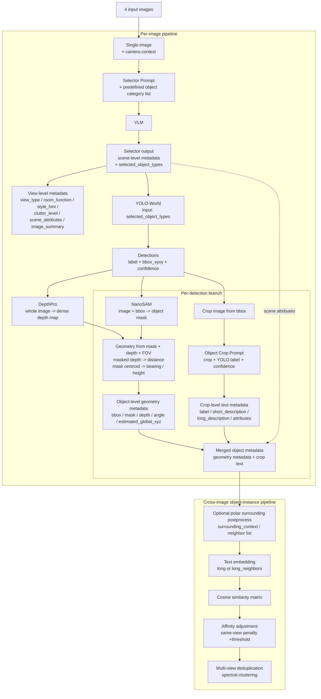
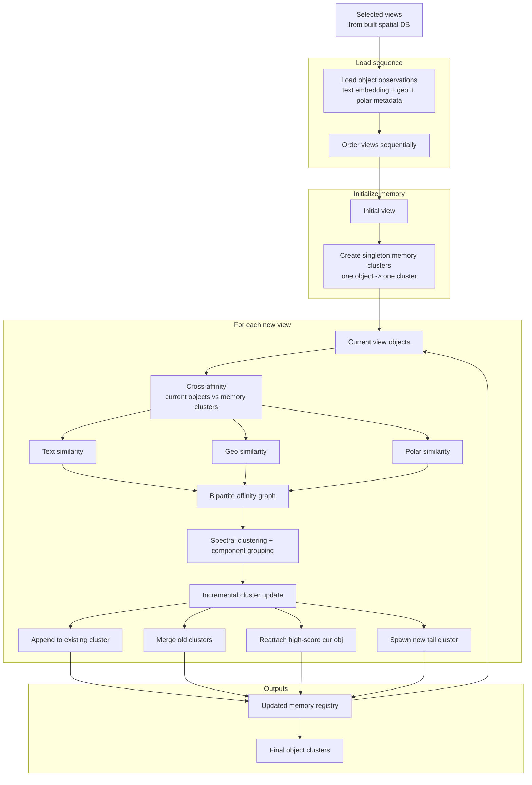

# Spatial RAG Pipeline Documentation

## No.1 Prompt Suite for Spatial RAG

### 1. Caption Image Prompt
**作用：**
用于对整张图片生成简洁的场景摘要，服务于 spatial retrieval。输出是 2-4 句的事实性场景总结，强调关键物体和大致布局。

**prompt内容：**
- **System:**
  You are an image understanding assistant.
  Write a compact factual summary of this scene for spatial retrieval.

- **User:**
  Summarize the visible scene in 2-4 sentences, including key objects and rough layout cues.


### 2. Object Crop Prompt（单个目标裁剪图描述）
**作用：**
用于对单个物体 crop 做精细描述。重点是：基于 detector 给出的类别，对 crop 中的主物体生成结构化 JSON，包括 label、short_description、long_description、attributes、distance_from_camera_m。适合构建 object-level database text。

**prompt内容：**
- **System:**
  You are a strict vision parser for object crops.
  Return JSON only, matching the schema exactly.
  Describe only the main visible object in the crop.
  Use the detector-provided class as the object category you must describe.
  Match the style of object descriptions used in a spatial database builder:
  the short description should read like a concise object instance description,
  and the long description should read like a detailed open-form object description.
  Do not return generic placeholders when any visible cue is available.
  If the object is partial, edge-cropped, occluded, blurred, dark, or tiny, explicitly say so in the descriptions.

- **User:**
  A detector has identified the object in this crop as "{yolo_label_clean or 'unknown'}"
  (confidence: {yolo_conf_text}).
  Treat this detected class as the object category to describe.
  Describe this specific object instance visible in the cropped image in the same style as the database builder's
  object fields: short_description should correspond to a short precise object description, and long_description
  should correspond to a detailed long-form open description.
  Ignore the wider room and focus on the object itself.
  Return a compact label for that detected category, a short description useful for retrieval,
  a richer long description, a list of notable visual attributes, and an approximate distance
  from the camera in meters when you can infer it. Mention the approximate distance directly
  in the short or long description when possible.

  **Requirements:**
  - `short_description` 必须 3 到 8 个词
  - 不能只写裸类别名，除非真的什么都看不出来
  - 必须至少包含一个可见特征，如颜色、材质、形状、状态、crop 中位置、是否部分可见
  - 倾向使用 noun phrase，如：
    "dark wooden chair edge crop"
    "gold-framed wall picture"
  - `long_description` 必须具体，尽量写出颜色、材质、纹理、形状、状态、大小线索、是否被裁切
  - 如果 crop 是 partial / clipped，要明确写 partial、cropped、edge、cut off
  - 不确定时也要描述“能看到的内容”，不要拒绝
  - `attributes` 应该是简洁的可见属性，不要泛泛而谈
  - Output JSON only


### 3. Object Extraction Prompt（整张图抽取对象，standard / angle_split）
**作用：**
用于对整张房间图进行完整的 scene-level + object-level 解析。
不仅输出整体场景属性，还会抽取多个 concrete objects，并给出每个物体的：
- description
- attributes
- relative_position_laterality / distance / verticality
- distance_from_camera_m
- relative_height_from_camera_m
- relative_bearing_deg
- support_relation
- any_text
- long_form_open_description
- location_relative_to_other_objects
- surrounding_context

适合做 downstream retrieval、deduplication、空间关系建模。

**prompt内容：**
- **System:**
  You are a strict vision parser for spatial retrieval.
  Return JSON only, matching the schema exactly.
  No markdown, no explanations, no extra keys.

- **User:**
  I am going to show you a photograph taken from a particular node location and orientation on a building.
  Your job is to describe the overall image, and separately extract concrete visible objects from this image
  to provide detailed descriptions and spatial characteristics for downstream retrieval and deduplication.
  Do not output wall feature or floor pattern as standalone objects.
  Put those into scene_attributes or into a nearby concrete object's attributes when relevant.

  **[camera_context_block]**
  - **如果没有 camera_context：**
    Camera global pose is unavailable for this request.
    Image geometry convention: horizontal FOV is {FOV} degrees.
    Straight ahead is 0 degrees.
    Objects near the left image edge are about -45 degrees.
    Objects near the right image edge are about +45 degrees.
    Negative bearing means left of image center.
    Positive bearing means right of image center.
    Still estimate each object's distance_from_camera_m and relative_bearing_deg from the image alone.

  - **如果有 camera_context：**
    Current camera global pose: x=..., z=..., orientation_deg=...
    Use this pose only to reason about spatial consistency.
    Do not return absolute global coordinates.
    Return relative geometry only, and let the downstream program compute global coordinates.
    Image geometry convention 同上。

  **[仅 angle_split 版本额外加入]**
  For relative_position_laterality, divide the image horizontally into exactly three discrete sectors:
  left, center, and right.
  Assign every object to exactly one of these sectors based on where most of the object appears in the image.
  Do not use laterality vaguely or comparatively; treat it as a strict bucket.
  Use left for objects mainly in the left third, center for the middle third, and right for the right third.

  **[共同主体要求]**
  For every object, estimate its approximate distance from the camera in meters whenever possible and fill
  distance_from_camera_m with that estimate.
  Also estimate relative_bearing_deg in the range [-90, 90], where 0 means the object is straight ahead,
  negative means left of image center, and positive means right of image center.
  Also estimate relative_height_from_camera_m, the object's vertical offset relative to the camera center in meters:
  negative means lower than the camera, positive means higher than the camera, and 0 means roughly level with the camera.
  Keep relative_position_distance broadly consistent with the meter estimate.

  For each primary object, list up to {OBJECT_SURROUNDING_MAX} visible surrounding objects in surrounding_context,
  sorted by increasing distance_from_primary_m.
  Each surrounding item must include:
  - label
  - attributes
  - distance_from_primary_m
  - distance_from_camera_m
  - relative_height_from_camera_m
  - relative_bearing_deg
  - relation_to_primary

  If a quantity cannot be inferred, return null instead of guessing.
  Do not return absolute global coordinates.

  **[输出 JSON 结构要求]**
  **顶层字段包括：**
  - view_type
  - room_function
  - style_hint
  - clutter_level
  - scene_attributes
  - visual_feature[]
  - floor_pattern
  - lighting_ceiling
  - wall_color
  - additional_notes
  - image_summary

  **每个 visual_feature 包括：**
  - type
  - description
  - attributes
  - relative_position_laterality
  - relative_position_distance
  - relative_position_verticality
  - distance_from_camera_m
  - relative_height_from_camera_m
  - relative_bearing_deg
  - support_relation
  - any_text
  - long_form_open_description
  - location_relative_to_other_objects
  - surrounding_context[]

  **结尾要求：**
  Fill in every JSON field above as completely as possible.
  If something is entirely out of frame or unidentifiable, you can use 'unknown' or null where allowed.
  Return at most {max_objects} items in visual_feature.
  Output JSON only.


### 4. Selector Prompt（场景总结 + 预选 object categories）
**作用：**
用于做 lightweight scene summarization 和 object category pre-selection。
这一阶段不做 object instance 枚举，也不做逐物体空间几何估计，只是从候选 household object list 中选出“这张图里明显可见、值得 detector/localizer 去找”的类别子集。

**prompt内容：**
- **System:**
  You are a strict vision parser for scene summarization and household category selection.
  Return JSON only, matching the schema exactly.
  Use only categories from the provided candidate list.

- **User:**
  I am going to show you a room image.
  Your job is to do scene summarization and object category pre-selection only.
  Do not enumerate object instances and do not estimate per-object geometry in this step.
  Use the candidate object list provided below as a household pre-list,
  and return only the subset that is clearly visible in the image.
  Prefer categories that are visually present as concrete objects, not inferred from context alone.
  Include an object type only if it is likely visible enough for a detector to localize.
  Exclude categories that are absent, ambiguous, or only suggested by the room type.

  [camera_context_block]
  Candidate object list: {selector_candidate_list_text(COMMON_PRELIST_OBJECT_TYPES)}.
  Return JSON only.


### 5. Camera Context Prompt Block（被多个 prompt 复用）
**作用：**
这是一个可复用的 prompt 片段，不是完整独立任务 prompt。
它负责把 camera pose 和图像几何约定塞进主 prompt，帮助模型更稳定地估计：
- distance_from_camera_m
- relative_bearing_deg
- relative_height_from_camera_m

并且避免返回 absolute global coordinates。

**prompt内容：**
- **无 camera_context 时：**
  Camera global pose is unavailable for this request.
  Image geometry convention: horizontal FOV is {FOV} degrees.
  Straight ahead is 0 degrees.
  Objects near the left image edge are about -45 degrees.
  Objects near the right image edge are about +45 degrees.
  Negative bearing means left of image center.
  Positive bearing means right of image center.
  Still estimate each object's distance_from_camera_m and relative_bearing_deg from the image alone.

- **有 camera_context 时：**
  Current camera global pose: x={camera_x:.3f}, z={camera_z:.3f}, orientation_deg={camera_orientation_deg:.1f}.
  Use this pose only to reason about spatial consistency.
  Do not return absolute global coordinates.
  Return relative geometry only, and let the downstream program compute global coordinates.
  Image geometry convention: horizontal FOV is {FOV} degrees.
  Straight ahead is 0 degrees.
  Objects near the left image edge are about -45 degrees.
  Objects near the right image edge are about +45 degrees.
  Negative bearing means left of image center.
  Positive bearing means right of image center.


---


## No.2 Pipeline1：VLM -> YOLOworld -> Spatial DB

### Input / Output
1. **VLM + selector prompt**：提取出图中可能存在的物体类别
2. 将提取出的物体类别作为 prompt 输入 + image，送入 **YOLOworld** 进行物体检测
3. **YOLOworld 返回**（本身不输出角度信息）：
   ```json
   {
     "det_idx": 0,
     "label": "couch",
     "bbox_xyxy": [496.889, 640.528, 1056.839, 1080.0],
     "confidence": 0.8892
   }
   ```

### Subpipeline: NanoSAM + DepthPro

#### 1. NanoSAM mask
- **作用：** 
  YOLO-World 只给出一个矩形框，但框里会混进背景。NanoSAM 的作用是把“框里的目标物体像素”从背景里抠出来，得到更精确的 object mask。
- **输入：**
  - `image_rgb`：整张 RGB 图
  - `bbox_xyxy`：YOLO-World 给出的检测框 `[x1, y1, x2, y2]`
- **输出：**
  是一个和原图同尺寸的布尔 mask：
  - shape: `(H, W)`
  - 类型: `bool` (True 表示该像素属于目标物体)

#### 2. DepthPro 深度估计

**步骤 1：Depth map 生成**
- **输入：** 原始图像 `image_path`
- **做法：** 用 `DepthProAdapter.predict_depth(...)` 对整张图跑一次 DepthPro，生成 dense depth map，也就是每个像素一个深度值。
- **输出：** `depth_map_m[H, W]`
- **代码位置：**
  - `object_geometry_pipeline.py` (line 402)
  - `object_geometry_pipeline.py` (line 724)

**步骤 2：Object mask extraction**
- **输入：** 
  - YOLO-World `bbox`
  - 原图
- **做法：** 用 NanoSAM 根据 bbox 生成 object mask，目标是把框里的背景去掉，只保留物体区域。
- **输出：** `mask[H, W]`，布尔前景掩码
- **代码位置：**
  - `object_geometry_pipeline.py` (line 286)
  - `object_geometry_pipeline.py` (line 754)

**步骤 3：Masked depth aggregation**
- **输入：**
  - `depth_map_m`
  - `object mask`
- **做法：** 
  - 只取 mask 内的有效 depth 像素
  - 去掉无效值和 `<= 0` 的值
  - 计算 median、trimmed median、p10、p90
  - 当前主流程实际使用 `trimmed_median_m` 作为该 object 的深度
- **输出：** `forward_depth_m`，以及辅助统计量 `median/p10/p90`
- **代码位置：**
  - `object_geometry_pipeline.py` (line 113)
  - `object_geometry_pipeline.py` (line 782)

**步骤 4：Convert depth into object-level geometry**
- **输入：**
  - `forward_depth_m`
  - object centroid 对应的 `angle`
- **做法：** 用 depth 作为物体相机前向深度。再结合水平角和垂直角，推导 `projected_planar_distance_m` 和 `relative_height_from_camera_m`。
- **输出：** 
  对象级几何 metadata：
  - `distance_from_camera_m`
  - `projected_planar_distance_m`
  - `relative_height_from_camera_m`

> **一句话总结**
> DepthPro 的核心不是“对每个 bbox 单独估深”，而是：先对整张图生成 dense depth map，再用 NanoSAM 的 object mask 在目标区域内聚合出稳健的 object depth，最后和角度一起转成 object-level spatial attributes。

#### 3. Angle Estimation
相机光轴中心 -> object mask 的 centroid，而不是 bbox center。

**核心概念：**
**mask centroid** 是由 NanoSAM 输出的 object mask 直接算出来的（分割出来的物体区域的几何中心，即像素均值中心）。
- **前景像素：** NanoSAM 认为属于该物体的像素
- **物体几何中心：** 这些前景像素坐标的平均值（mask centroid）
- **角度计算：** 用“物体几何中心相对图像中心的偏移”结合相机 FOV，按小孔成像公式换算成 `relative_bearing_deg` 和 `vertical_angle_deg`。

**计算方式详细步骤：**
1. **选物体代表点**
   先不用 bbox center，而是用 NanoSAM mask 的 centroid 作为物体在图像里的代表点：
   `x_obj, y_obj = mask centroid` (分割出来的前景像素坐标均值)

2. **定义相机光轴中心**
   把图像中心当作相机光轴投影点：
   `cx = (W - 1) / 2`
   `cy = (H - 1) / 2`
   (这里 `W` 是图像宽度，`H` 是图像高度)

3. **用 FOV 反推出像素焦距**
   已知水平视场角 `HFOV`，先算：
   `fx = W / (2 * tan(HFOV / 2))`
   再根据图像宽高比得到垂直视场角 `VFOV`，进一步算：
   `fy = H / (2 * tan(VFOV / 2))`

4. **把像素偏移变成角度**
   用小孔成像模型，把“物体中心相对图像中心的偏移”转成视线角度：
   - **水平角 / bearing:**
     `relative_bearing_deg = atan((x_obj - cx) / fx)`
   - **垂直角:**
     `vertical_angle_deg = atan((cy - y_obj) / fy)`
   最后再转换成 degree。

5. **符号约定**
   - `relative_bearing_deg < 0`：物体在图像中心左边
   - `relative_bearing_deg > 0`：物体在图像中心右边
   - `vertical_angle_deg > 0`：物体高于相机中心视线
   - `vertical_angle_deg < 0`：物体低于相机中心视线

> **一句话总结**
> 这套方法本质上是：把“物体 mask 几何中心”看作视线目标点，再根据它相对图像中心的像素偏移，结合相机 FOV，用小孔成像公式换算成相对水平角和垂直角。


---


### 1. Object Instance Pipeline
**text embedding (with neighbor) -> affinity -> batch multi-view dedup**




这个 pipeline 的核心思想是：
先把 object 自身描述和它的邻居信息拼成一段增强文本，再做 embedding，然后只用 text cosine similarity 做 batch multi-view dedup。
这里的 affinity 只用了文本 embedding 相似度，没有使用 geo 和 polar。

#### 输入 metadata 是什么样
假设当前有一个 object record，主对象是 dining table：
```json
{
  "object_global_id": 93,
  "label": "dining table",
  "long_form_open_description": "a wooden dining table with a dark surface in the kitchen",
  "surrounding_context": [
    {
      "label": "chair",
      "relation_to_primary": "slightly left, slightly behind",
      "distance_from_primary_m": 0.6
    },
    {
      "label": "cabinet",
      "relation_to_primary": "slightly right, slightly behind",
      "distance_from_primary_m": 1.0
    }
  ]
}
```
这里实际参与增强文本构造的关键字段是：
- `long_form_open_description`
- `surrounding_context[i].label`
- `surrounding_context[i].relation_to_primary`
- `surrounding_context[i].distance_from_primary_m`

#### 文本增强后长什么样
原本 object 的 long text：
> a wooden dining table with a dark surface in the kitchen

加入 neighbor metadata 之后，真正送去 embedding 的文本变成：
> a wooden dining table with a dark surface in the kitchen | neighbors: chair [slightly left, slightly behind, 0.6m]; cabinet [slightly right, slightly behind, 1.0m]

可以理解为：
- **主对象文本**描述 object 自身视觉语义
- **neighbor list** 提供 object 周边上下文

两者拼在一起后，更利于区分“长得像但周边环境不同”的对象。

#### affinity 怎么算
这条 pipeline 里，最终还是普通文本相似度：
`affinity(i, j) = cosine_similarity( embedding(text_i), embedding(text_j) )`

也就是说：
- 不看 `distance_from_camera_m`
- 不看 `relative_bearing_deg`
- 不看 `relative_height_from_camera_m`
- 不看全局 `estimated_global_x/y/z`
只看拼好的文本 embedding 是否相似。

#### 一个更完整的例子
**View A 里的 object**
```json
{
  "label": "dining table",
  "long_form_open_description": "a wooden dining table with a dark surface in the kitchen",
  "surrounding_context": [
    {
      "label": "chair",
      "relation_to_primary": "slightly left, slightly behind",
      "distance_from_primary_m": 0.6
    },
    {
      "label": "cabinet",
      "relation_to_primary": "slightly right, slightly behind",
      "distance_from_primary_m": 1.0
    }
  ]
}
```
增强后文本：
> a wooden dining table with a dark surface in the kitchen | neighbors: chair [slightly left, slightly behind, 0.6m]; cabinet [slightly right, slightly behind, 1.0m]

**View B 里的 object**
```json
{
  "label": "dining table",
  "long_form_open_description": "a dark wooden dining table in the kitchen area",
  "surrounding_context": [
    {
      "label": "chair",
      "relation_to_primary": "left, slightly behind",
      "distance_from_primary_m": 0.7
    },
    {
      "label": "cabinet",
      "relation_to_primary": "right, behind",
      "distance_from_primary_m": 1.1
    }
  ]
}
```
增强后文本：
> a dark wooden dining table in the kitchen area | neighbors: chair [left, slightly behind, 0.7m]; cabinet [right, behind, 1.1m]

然后：
1. 对这两段增强文本分别做 embedding
2. 用 cosine similarity 算 affinity
3. affinity 高，就更可能被 dedup 成同一个 object instance

---

### 2. Sequential Pipeline
**text embedding (no neighbor) + geo + polar -> affinity**



这条 pipeline 和上面不同：
- text embedding 不带 neighbor
- affinity 不只看 text，还会额外加入 geo similarity 和 polar similarity
所以它更像是一个多模态/多因素的相似度融合。
- initialize memory cluster 的时候，每个 object 就是一个 cluster, 初始clusters相互之间不会被合并

#### 2.1 Text embedding
这里用的是 object 自身文本，不拼 neighbor。
例如：
```json
{
  "label": "dining table",
  "long_form_open_description": "a wooden dining table with a dark surface in the kitchen"
}
```
送去 embedding 的就是：
> a wooden dining table with a dark surface in the kitchen

这一项主要比较的是：这个 object 的语义描述像不像历史 cluster 里的对象。

#### 2.2 Geo
Geo 表示：在世界坐标里，这个 object 和 memory cluster 的位置接不接近。
它用的是 object 的全局坐标，例如：
```json
{
  "estimated_global_x": -3.42,
  "estimated_global_y": 0.78,
  "estimated_global_z": 5.16
}
```
历史 memory cluster 也会有一个代表性的 prototype/global position。
Geo similarity 本质上是在看：
- 新对象在房间里是不是出现在差不多的位置
- 是否和某个已有 cluster 空间上接近

你可以把它理解成：**text 像不像是同一种东西，geo 像不像是在同一个地方。**

#### 2.3 Polar
Polar 表示：在相机视角坐标里，这个 object 的相对位置形状和历史 cluster 像不像。
这里用到的关键 metadata 是：
```json
{
  "distance_from_camera_m": 2.4,
  "relative_bearing_deg": -18.0,
  "relative_height_from_camera_m": 0.3
}
```

**这些 polar 字段分别是什么意思**
- `distance_from_camera_m`: 物体离相机有多远，单位米。值越大，说明物体越远。
  - 例如：`0.8` (离相机比较近)
  - 例如：`3.5` (离相机比较远)
- `relative_bearing_deg`: 物体相对相机中心视线的水平角度。
  - 负值：物体在画面左边
  - 正值：物体在画面右边
  - 绝对值越大：偏得越明显
  - 例如：`-25 deg` (明显在左边)，`0 deg` (接近画面中心)，`+18 deg` (偏右)
- `relative_height_from_camera_m`: 物体相对相机高度的上下差，单位米。本质上是在说：这个物体比相机高还是低、差多少米。
  - 例如：`+0.6` (物体比相机视平线高)
  - 例如：`-0.4` (物体比相机低)

**Polar similarity 怎么比较**
假设当前新对象（row）：
```json
{
  "distance_from_camera_m": 2.4,
  "relative_bearing_deg": -18.0,
  "relative_height_from_camera_m": 0.3
}
```
历史 cluster 的 `prototype_polar`：
```json
{
  "distance_from_camera_m": 2.0,
  "relative_bearing_deg": -10.0,
  "relative_height_from_camera_m": 0.1
}
```
注意：这里的 cluster_distance / cluster_bearing / cluster_height 不是单个旧对象，而是 memory cluster 的 `prototype_polar`，也就是历史成员这些 polar 字段的代表值。

**第一步：算归一化差值**
- 距离差：`(row_distance - cluster_distance) / 2.0 = (2.4 - 2.0) / 2.0 = 0.2`
- 水平角差：`wrap(row_bearing - cluster_bearing) / 45.0 = wrap(-18 - (-10)) / 45 = -8 / 45 ≈ -0.178`
- 高度差：`(row_height - cluster_height) / 1.0 = (0.3 - 0.1) / 1.0 = 0.2`

于是得到一个 polar difference vector：
`dims = [0.2, -0.178, 0.2]`

**第二步：算 L2 norm**
`||dims|| = sqrt(0.2^2 + (-0.178)^2 + 0.2^2)`
这个值越小，表示新的 object 和 cluster 在 polar geometry 上越像。

**第三步：过高斯函数**
`polar_similarity = exp( - ||dims||^2 )`
所以：
- 如果三个维度都很接近，`||dims||` 很小，`polar_similarity` 接近 1
- 如果差别很大，`||dims||` 变大，`polar_similarity` 迅速变小

**直观理解**
这条 sequential pipeline 在比较一个 object 是否属于某个历史 cluster 时，实际上看三件事：
1. **Text**: 这个 object 的文本描述像不像那个 cluster
2. **Geo**: 它在世界坐标里的位置是不是也接近那个 cluster
3. **Polar**: 它在当前相机视角下呈现出的相对距离 / 左右角度 / 高低关系是不是也像那个 cluster

---

#### 2.4 Maintain cluster
因为一个 cluster 里可能已经有多个历史 object observations，系统不可能每次都拿新 object 和 cluster 里所有成员逐个比，所以会先把 cluster 压缩成几个代表值，也就是 prototype；prototype 是为了让“一个 cluster”能像“一个可比较的对象”一样参与匹配。

**1. `prototype_embedding`**
表示这个 cluster 的文本语义中心

**它是：**
- cluster 内所有成员的 text embedding
- 先求平均
- 再做 L2 normalize

**作用是：**
代表这个 cluster 的“语义长相”

后面新 object 来了，就拿它的 embedding 去和这个 `prototype_embedding` 比，算 text similarity。

**2. `prototype_xyz`**
表示这个 cluster 的全局空间位置代表值

**它由成员的：**
- `estimated_global_x`
- `estimated_global_y`
- `estimated_global_z`

聚合得到，当前实现里取的是中位数。

**作用是：**
代表这个 cluster 在世界坐标里的大致位置

后面新 object 来了，就和这个 `prototype_xyz` 比，算 geo similarity。

**3. `prototype_polar`**
表示这个 cluster 的相机相对几何代表值

**它由成员的：**
- `distance_from_camera_m`
- `relative_bearing_deg`
- `relative_height_from_camera_m`

聚合得到，当前实现里也是取中位数。

**作用是：**
代表这个 cluster 在视角坐标里的典型相对位置形态

后面新 object 来了，就和这个 `prototype_polar` 比，算 polar similarity。


### 3. 两条 pipeline 的核心区别

#### Batch multi-view dedup
**text only**
- text embedding 用了 neighbor-enhanced text
- affinity 只看 text cosine similarity
- 不看 geo，不看 polar

#### Sequential pipeline
**text + geometry**
- text embedding 不用 neighbor
- affinity 同时结合：text similarity、geo similarity、polar similarity

**概括：**
- **batch multi-view dedup** 更偏“文本上下文增强后的去重”
- **sequential pipeline** 更偏“文本 + 空间几何联合匹配”

| Item | Value |
|---|---:|
| Total images | 164 |
| Total objects | 1095 |
| Avg objects per image | 6.68 |
| `mask_depth` route images | 120 |
| `vlm_fallback` route images | 44 |
| Avg VLM tokens per image | 14,186.17 |
| Avg prompt tokens per image | 7,461.44 |
| Avg completion tokens per image | 6,724.73 |


| Stage | Scope / Calls | Time Total (s) | Avg Time | Prompt Tokens | Completion Tokens | Total Tokens | Avg Total Tokens | Notes |
|---|---:|---:|---:|---:|---:|---:|---:|---|
| Selector VLM | 164 image-level calls | 2389.31 | 14.57 s / call | 459,364 | 207,700 | 667,064 | 4,067.46 / call | scene summarization + selected_object_types |
| Scene-Objects VLM (fallback parse) | 44 fallback image calls | 1965.09 | 44.66 s / call | 172,260 | 186,003 | 358,263 | 8,142.34 / call | only used on `vlm_fallback` route |
| Crop VLM Description | 883 object-crop calls | 8426.64 | 9.54 s / call | 592,052 | 709,153 | 1,301,205 | 1,473.62 / call | dominant cost in `mask_depth` route |
| **Total VLM** | **1091 VLM calls** | **12781.04** | **11.72 s / call** | **1,223,676** | **1,102,856** | **2,326,532** | **2,132.48 / call** | sum of all VLM calls above |
| Detector (YOLO-World) | 164 image-level calls | 36.51 | 0.22 s / image | — | — | — | — | open-vocab detection |
| DepthPro | 120 `mask_depth` images | 50.01 | 0.42 s / image | — | — | — | — | dense depth estimation |
| NanoSAM Mask | 120 `mask_depth` images | 60.81 | 0.51 s / image | — | — | — | — | total mask refinement time per image |
| Angle Geometry | 120 `mask_depth` images | 9.24 | 0.08 s / image | — | — | — | — | centroid + bearing + projection |
| View Embedding | 164 images | 21.99 | 0.13 s / image | — | — | — | — | frame-level embedding |
| Object Embedding | 164 images | 31.87 | 0.19 s / image | — | — | — | — | object text embedding |
| Dependency Setup | 164 images | 460.12 | 2.81 s / image | — | — | — | — | detector / NanoSAM / DepthPro init |
| Geometry Pipeline Total | 164 images | 11475.60 | 69.97 s / image | — | — | — | — | includes detector/depth/mask/crop-VLM or fallback branch |
| Frame Total | 164 images | 13498.11 | 82.31 s / image | — | — | — | — | end-to-end per image |


## Appendix: Metadata Format

### 1. `metadata.jsonl`
每条记录表示：一张 frame / view 的视图级 metadata，它更偏“view summary”，不是 object-level 明细。
```json
{
    "id": 0, // 该 frame/view 的主 id
    "frame_id": 0, // frame 序号
    "x": -11.9470, // 该 view/camera 的世界坐标 x
    "y": -2.9729, // 该 view/camera 的世界坐标 z
    "world_position": [-11.9470, -0.2366, -2.9729], // 相机 3D 世界坐标 [x, y, z]
    "orientation": 0, // 该 frame 的相机朝向
    "file_name": "images/pose_00000_o000_000000.jpg", // 图像路径
    "text": "black-framed sailboat print, glazed | ...", // 该 frame 的主文本表示
    "frame_text_short": "black-framed sailboat print, glazed | ...", // 该 frame 的短文本摘要
    "frame_text_long": "center sector | Rectangular black frame ...", // 该 frame 的长文本摘要

    "parse_status": "ok", // 该 frame 解析状态
    "parse_warnings": [], // 该 frame 解析警告列表

    "raw_vlm_output": "{\"view_type\": \"staircase\", ...}", // 原始 VLM 输出字符串，通常是 JSON 文本
    "raw_api_source": "cache", // 该结果来自 API 还是 cache

    "text_input_for_clip_short": "black-framed sailboat print, glazed | ...", // 给 CLIP 的短文本输入
    "text_input_for_clip_long": "center sector | Rectangular black frame ...", // 给 CLIP 的长文本输入

    "object_text_inputs_short": [...], // 该 frame 内每个对象的短文本列表
    "object_text_inputs_long": [...], // 该 frame 内每个对象的长文本列表

    "builder_variant": "angle_split", // 构建数据库时使用的 builder 变体
    "object_prompt_variant": "angle_split", // 对象抽取时使用的 VLM prompt variant
    "attribute": {...}, // 该 frame 的结构化场景属性
    "object_count": 3 // 该 frame 内对象数量
}
```
**`attribute` 子结构如下：**
```json
{
    "view_type": "staircase", // 房间/视图类型
    "room_function": "circulation", // 房间功能
    "style_hint": "traditional", // 风格提示
    "clutter_level": "low", // 杂乱程度
    "floor_pattern": "carpet", // 地面材质/纹理
    "lighting_ceiling": "natural light source", // 照明类型
    "wall_color": "beige", // 墙面主色
    "scene_attributes": ["beige walls", "carpeted stairs", ...], // 场景级属性
    "additional_notes": "Right side shows stair banister/railing...", // 附加备注
    "image_summary": "Interior view of a beige-walled staircase area ..." // 场景总结
}
```

### 2. `object_meta_with_polar_surroundings.jsonl`
每条记录表示：一个 object 的最终对象级 metadata。
```json
{
    "object_global_id": 0, // 全局唯一 object id，用于跨文件引用该对象
    "frame_id": 0, // 该 object 所属的 frame 序号
    "entry_id": 0, // 该 object 所属的视角/entry id
    "file_name": "images/pose_00000_o000_000000.jpg", // 原始图像相对路径

    "x": -11.9470, // 该 view/camera 的世界坐标 x
    "y": -2.9729, // 该 view/camera 的世界坐标 z；（这个工程里常用 x,y 表示平面位置）
    "world_position": [-11.9470, -0.2366, -2.9729], // 相机的 3D 世界坐标 [x, y, z]

    "orientation": 0, // 该 frame 的相机朝向，单位度
    "frame_orientation": 0, // frame 级朝向信息，通常与 orientation 一致
    "object_orientation_deg": 344, // 对象的最终全局朝向/方向编码，通常由相机朝向和相对 bearing 推得

    "angle_bucket": "center", // 对象落入的离散水平角桶，如 left / center / right
    "angle_split_step_deg": 30, // 角度离散化使用的步长
    "builder_variant": "angle_split", // 数据库构建变体；这里表示采用 angle-split 版本

    "object_local_id": "det_000", // 该 object 在当前 view 内的局部 id
    "label": "picture frame", // 对象最终 canonical label
    "object_confidence": 0.9086, // 对象主置信度，通常来自 detector

    "bbox_xywh_norm": [0.5778, 0.0603, 0.1407, 0.2266], // 归一化 bbox，格式为 [x, y, w, h]
    "bbox_xyxy": [1109.39, 65.16, 1379.45, 309.91], // 像素坐标 bbox，格式为 [x1, y1, x2, y2]

    "facing": "unknown", // 对象朝向语义标签；当前很多样本里可能未知
    "orientation_confidence": 0.0, // 对象朝向估计的置信度

    "description": "black-framed sailboat print, glazed", // 对象短描述，用于简洁检索
    "long_form_open_description": "Rectangular black frame ...", // 对象长描述，用于更丰富的检索和说明
    "attributes": ["black frame", "white double mat", ...], // 对象可见属性列表

    "laterality": "center", // 对象在图像中的左右位置
    "distance_bin": "middle", // 对象的离散距离分桶
    "verticality": "high", // 对象在图像中的垂直位置分桶

    "distance_from_camera_m": 3.7554, // 对象距离相机的深度估计，单位米
    "relative_height_from_camera_m": 1.3745, // 对象相对相机中心的高度偏移，单位米
    "relative_bearing_deg": 16.4281, // 对象相对相机光轴的水平角，单位度
    "estimated_global_x": -10.8397, // 由 depth + bearing 投影得到的对象全局 x
    "estimated_global_y": 1.1379, // 由 vertical angle / height 推得的对象全局 y
    "estimated_global_z": -6.7283, // 由 depth + bearing 投影得到的对象全局 z

    "any_text": "", // 对象上识别到的文本；没有则为空字符串
    "location_relative_to_other_objects": "picture frame@1.20m[slightly right, above|E]", // 对象相对周边物体的压缩关系描述

    "surrounding_context": [...], // 对象周边上下文列表；每个元素是一个邻近对象关系
    "surrounding_source": "polar_postprocess_v1", // surrounding_context 的生成来源

    "scene_attributes": ["beige walls", "carpeted stairs", ...], // 该 view 的场景级属性
    "view_type": "staircase", // 房间/视图类型
    "room_function": "circulation", // 房间功能
    "style_hint": "traditional", // 风格提示
    "clutter_level": "low", // 杂乱程度

    "object_text_short": "black-framed sailboat print, glazed", // 对象短文本，供检索/embedding
    "object_text_long": "center sector | Rectangular black frame ...", // 对象长文本，供检索/embedding
    "text_input_for_clip_short": "black-framed sailboat print, glazed", // 给 CLIP 的短文本输入
    "text_input_for_clip_long": "center sector | Rectangular black frame ...", // 给 CLIP 的长文本输入

    "parse_status": "ok", // 该 object record 的解析状态
    "geometry_source": "mask_depth", // 几何来源；表示由 mask + depth pipeline 得到
    "geometry_fallback_reason": null, // 如果走了 fallback，这里记录原因；否则为空

    "detector_label": "picture frame", // YOLO-World 原始标签
    "detector_confidence": 0.9086, // YOLO-World 原始检测置信度

    "mask_area_px": 59000, // mask 前景像素数
    "mask_area_ratio": 0.02845, // mask 面积占整张图比例
    "mask_centroid_x_px": 1242.5542, // mask centroid 的 x 像素坐标
    "mask_centroid_y_px": 188.1262, // mask centroid 的 y 像素坐标
    "mask_centroid_x_norm": 0.6472, // mask centroid 的归一化 x
    "mask_centroid_y_norm": 0.1742, // mask centroid 的归一化 y

    "depth_stat_median_m": 3.7554, // mask 内 depth 的中位数
    "depth_stat_p10_m": 3.7353, // mask 内 depth 的 10 分位数
    "depth_stat_p90_m": 3.7744, // mask 内 depth 的 90 分位数
    "projected_planar_distance_m": 3.9152, // 根据 bearing 从 forward depth 投影出的平面距离
    "vertical_angle_deg": 20.1034, // 对象相对相机光轴的垂直角

    "vlm_distance_from_camera_m": 2.0, // crop-level VLM 估计的距离，可作对照
    "vlm_relative_bearing_deg": null, // VLM 估计的 bearing；当前样本中通常为空

    "crop_path": "spatial_db_nd/geometry/view_00000/objects/obj_000_crop.jpg", // 对象 crop 图路径
    "mask_path": "spatial_db_nd/geometry/view_00000/objects/obj_000_mask.png", // 对象 mask 图路径
    "mask_overlay_path": "spatial_db_nd/geometry/view_00000/objects/obj_000_mask_overlay.jpg", // mask overlay 可视化路径
    "depth_map_path": "spatial_db_nd/geometry/view_00000/depth_map.npy", // 该 view 的 depth map 路径

    "crop_vlm_label": "picture frame", // crop VLM 返回的对象标签
    "view_id": "view_00000" // 该 object 所属 view id
}
```
**`surrounding_context` 结构如下：**
```json
{
    "target_object_global_id": 1, // 被关联的邻近对象 id
    "label": "picture frame", // 邻近对象标签
    "distance_from_primary_m": 1.1987, // 邻近对象到当前主对象的距离
    "delta_angle_deg": 18.3999, // 邻近对象相对主对象的角度差
    "delta_depth_m": -0.0137, // 邻近对象相对主对象的深度差
    "delta_height_m": 0.6624, // 邻近对象相对主对象的高度差
    "semantic_relation_local": "slightly right, above", // 局部语义关系
    "relation_to_primary": "slightly right, above", // 与主对象的关系文本
    "allocentric_bearing_deg": 90.5243, // 在全局/allocentric 参考系下的方位角
    "allocentric_direction_8": "E", // 8 方向离散方位
    "estimated_global_x": -9.3437, // 邻近对象全局 x
    "estimated_global_y": 1.8003, // 邻近对象全局 y
    "estimated_global_z": -6.7146 // 邻近对象全局 z
}
```

### 3. `object_object_relations.jsonl`
```json
{
    "entry_id": 0, // 该关系所属的 entry/view 序号
    "view_id": "view_00000", // 该关系所属 view id

    "source_object_global_id": 0, // 关系源对象的全局 id
    "target_object_global_id": 1, // 关系目标对象的全局 id

    "source_obs_id": "obs_000000", // 源对象的 observation id
    "target_obs_id": "obs_000001", // 目标对象的 observation id

    "source_label": "picture frame", // 源对象标签
    "target_label": "picture frame", // 目标对象标签

    "source_x": -10.8397, // 源对象全局 x
    "source_y": 1.1379, // 源对象全局 y
    "source_z": -6.7283, // 源对象全局 z

    "target_x": -9.3437, // 目标对象全局 x
    "target_y": 1.8003, // 目标对象全局 y
    "target_z": -6.7146, // 目标对象全局 z

    "dx": 1.4960, // 目标相对源的 x 方向位移
    "dy": 0.6624, // 目标相对源的 y 方向位移
    "dz": 0.0137, // 目标相对源的 z 方向位移

    "distance_m": 1.4961, // 平面距离或主关系距离，只用x和z算
    "distance_3d_m": 1.6361, // 3D 欧式距离，用 x、y、z 全部算

    "direction": "right", // 目标相对源的主要方向
    "direction_frame": "view_aligned", // 方向定义所依据的坐标系
    "vertical_direction": "above", // 目标相对源的垂直关系

    "relation_type": "ObjectObject", // 关系类型
    "relation_source": "geometry_postprocess" // 关系生成来源
}
```