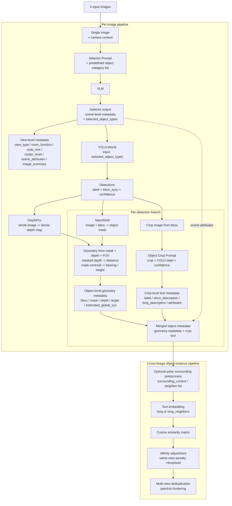
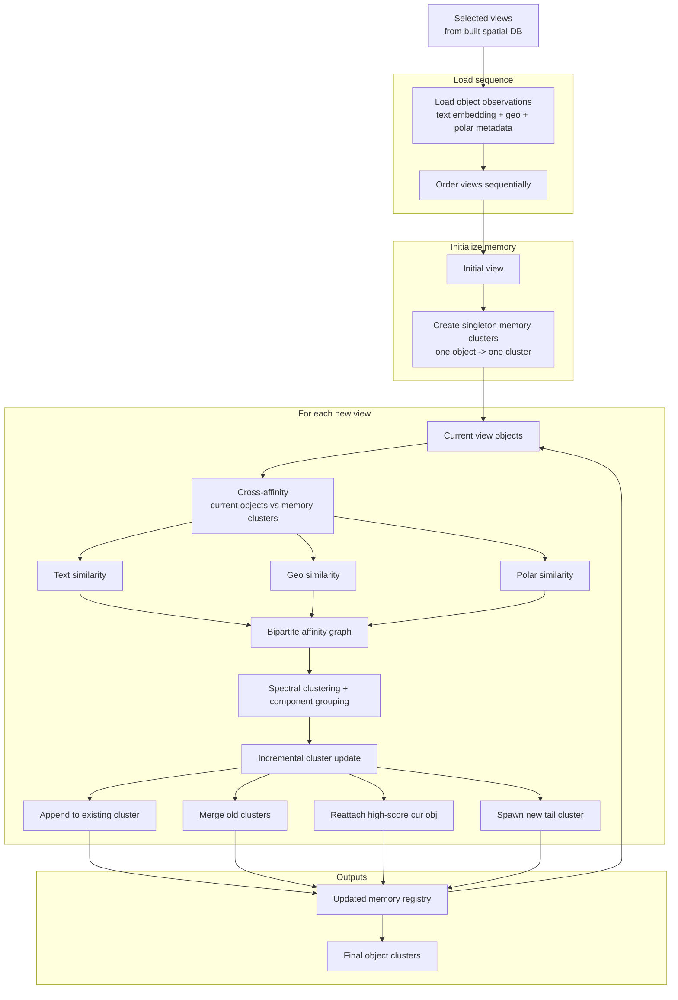

# Spatial RAG Pipeline Documentation

## No.1 Prompt Suite for Spatial RAG

### 1. Caption Image Prompt
**Purpose:**
Used to generate a concise scene summary for the entire image for spatial retrieval. The output is a factual 2–4 sentence scene summary that emphasizes key objects and the rough layout.

**Prompt content:**
- **System:**
  You are an image understanding assistant.
  Write a compact factual summary of this scene for spatial retrieval.

- **User:**
  Summarize the visible scene in 2-4 sentences, including key objects and rough layout cues.


### 2. Object Crop Prompt (single-object crop description)
**Purpose:**
Used to generate a fine-grained description for a single object crop. The focus is to generate structured JSON for the main object in the crop, based on the category provided by the detector, including label, short_description, long_description, attributes, and distance_from_camera_m. Suitable for constructing object-level database text.

**Prompt content:**
- **System:**
  You are a strict vision parser for object crops.
  Return JSON only, matching the schema exactly.
  Describe only the main visible object in the crop.
  Use the detector-provided class as the object category you must describe.
  Match the style of object descriptions used in a spatial database builder:
  the short description should read like a concise object instance description,
  and the long description should read like a detailed open-form object description.
  Do not return generic placeholders when any visible cue is available.
  If the object is partial, edge-cropped, occluded, blurred, dark, or tiny, explicitly say so in the descriptions.

- **User:**
  A detector has identified the object in this crop as "{yolo_label_clean or 'unknown'}"
  (confidence: {yolo_conf_text}).
  Treat this detected class as the object category to describe.
  Describe this specific object instance visible in the cropped image in the same style as the database builder's
  object fields: short_description should correspond to a short precise object description, and long_description
  should correspond to a detailed long-form open description.
  Ignore the wider room and focus on the object itself.
  Return a compact label for that detected category, a short description useful for retrieval,
  a richer long description, a list of notable visual attributes, and an approximate distance
  from the camera in meters when you can infer it. Mention the approximate distance directly
  in the short or long description when possible.

  **Requirements:**
  - `short_description` must be 3 to 8 words
  - Do not write only the bare category name unless absolutely nothing is visible
  - It must include at least one visible feature, such as color, material, shape, state, position in the crop, or whether it is partially visible
  - Prefer using a noun phrase, such as:
    "dark wooden chair edge crop"
    "gold-framed wall picture"
  - `long_description` must be specific and should include color, material, texture, shape, state, size cues, and whether it is cropped whenever possible
  - If the crop is partial / clipped, explicitly mention partial, cropped, edge, or cut off
  - Even when uncertain, describe what is visible instead of refusing
  - `attributes` should be concise visible attributes, not vague generalities
  - Output JSON only


### 3. Object Extraction Prompt (extracting objects from the whole image, standard / angle_split)
**Purpose:**
Used to perform full scene-level + object-level parsing for an entire room image.
It not only outputs overall scene attributes, but also extracts multiple concrete objects and provides, for each object:
- description
- attributes
- relative_position_laterality / distance / verticality
- distance_from_camera_m
- relative_height_from_camera_m
- relative_bearing_deg
- support_relation
- any_text
- long_form_open_description
- location_relative_to_other_objects
- surrounding_context

Suitable for downstream retrieval, deduplication, and spatial relationship modeling.

**Prompt content:**
- **System:**
  You are a strict vision parser for spatial retrieval.
  Return JSON only, matching the schema exactly.
  No markdown, no explanations, no extra keys.

- **User:**
  I am going to show you a photograph taken from a particular node location and orientation on a building.
  Your job is to describe the overall image, and separately extract concrete visible objects from this image
  to provide detailed descriptions and spatial characteristics for downstream retrieval and deduplication.
  Do not output wall feature or floor pattern as standalone objects.
  Put those into scene_attributes or into a nearby concrete object's attributes when relevant.

  **[camera_context_block]**
  - **If there is no camera_context:**
    Camera global pose is unavailable for this request.
    Image geometry convention: horizontal FOV is {FOV} degrees.
    Straight ahead is 0 degrees.
    Objects near the left image edge are about -45 degrees.
    Objects near the right image edge are about +45 degrees.
    Negative bearing means left of image center.
    Positive bearing means right of image center.
    Still estimate each object's distance_from_camera_m and relative_bearing_deg from the image alone.

  - **If there is camera_context:**
    Current camera global pose: x=..., z=..., orientation_deg=...
    Use this pose only to reason about spatial consistency.
    Do not return absolute global coordinates.
    Return relative geometry only, and let the downstream program compute global coordinates.
    Same image geometry convention as above.

  **[only additionally included in the angle_split version]**
  For relative_position_laterality, divide the image horizontally into exactly three discrete sectors:
  left, center, and right.
  Assign every object to exactly one of these sectors based on where most of the object appears in the image.
  Do not use laterality vaguely or comparatively; treat it as a strict bucket.
  Use left for objects mainly in the left third, center for the middle third, and right for the right third.

  **[shared main requirements]**
  For every object, estimate its approximate distance from the camera in meters whenever possible and fill
  distance_from_camera_m with that estimate.
  Also estimate relative_bearing_deg in the range [-90, 90], where 0 means the object is straight ahead,
  negative means left of image center, and positive means right of image center.
  Also estimate relative_height_from_camera_m, the object's vertical offset relative to the camera center in meters:
  negative means lower than the camera, positive means higher than the camera, and 0 means roughly level with the camera.
  Keep relative_position_distance broadly consistent with the meter estimate.

  For each primary object, list up to {OBJECT_SURROUNDING_MAX} visible surrounding objects in surrounding_context,
  sorted by increasing distance_from_primary_m.
  Each surrounding item must include:
  - label
  - attributes
  - distance_from_primary_m
  - distance_from_camera_m
  - relative_height_from_camera_m
  - relative_bearing_deg
  - relation_to_primary

  If a quantity cannot be inferred, return null instead of guessing.
  Do not return absolute global coordinates.

  **[JSON output structure requirements]**
  **Top-level fields include:**
  - view_type
  - room_function
  - style_hint
  - clutter_level
  - scene_attributes
  - visual_feature[]
  - floor_pattern
  - lighting_ceiling
  - wall_color
  - additional_notes
  - image_summary

  **Each visual_feature includes:**
  - type
  - description
  - attributes
  - relative_position_laterality
  - relative_position_distance
  - relative_position_verticality
  - distance_from_camera_m
  - relative_height_from_camera_m
  - relative_bearing_deg
  - support_relation
  - any_text
  - long_form_open_description
  - location_relative_to_other_objects
  - surrounding_context[]

  **Ending requirements:**
  Fill in every JSON field above as completely as possible.
  If something is entirely out of frame or unidentifiable, you can use 'unknown' or null where allowed.
  Return at most {max_objects} items in visual_feature.
  Output JSON only.


### 4. Selector Prompt (scene summary + pre-selected object categories)
**Purpose:**
Used for lightweight scene summarization and object category pre-selection.
At this stage, no object instance enumeration or per-object spatial geometry estimation is performed. It only selects the subset of categories from the candidate household object list that are clearly visible in the image and worth searching for with the detector/localizer.

**Prompt content:**
- **System:**
  You are a strict vision parser for scene summarization and household category selection.
  Return JSON only, matching the schema exactly.
  Use only categories from the provided candidate list.

- **User:**
  I am going to show you a room image.
  Your job is to do scene summarization and object category pre-selection only.
  Do not enumerate object instances and do not estimate per-object geometry in this step.
  Use the candidate object list provided below as a household pre-list,
  and return only the subset that is clearly visible in the image.
  Prefer categories that are visually present as concrete objects, not inferred from context alone.
  Include an object type only if it is likely visible enough for a detector to localize.
  Exclude categories that are absent, ambiguous, or only suggested by the room type.

  [camera_context_block]
  Candidate object list: {selector_candidate_list_text(COMMON_PRELIST_OBJECT_TYPES)}.
  Return JSON only.


### 5. Camera Context Prompt Block (reused by multiple prompts)
**Purpose:**
This is a reusable prompt fragment, not a complete standalone task prompt.
It is responsible for injecting the camera pose and image geometry conventions into the main prompt, helping the model estimate the following more stably:
- distance_from_camera_m
- relative_bearing_deg
- relative_height_from_camera_m

It also avoids returning absolute global coordinates.

**Prompt content:**
- **When there is no camera_context:**
  Camera global pose is unavailable for this request.
  Image geometry convention: horizontal FOV is {FOV} degrees.
  Straight ahead is 0 degrees.
  Objects near the left image edge are about -45 degrees.
  Objects near the right image edge are about +45 degrees.
  Negative bearing means left of image center.
  Positive bearing means right of image center.
  Still estimate each object's distance_from_camera_m and relative_bearing_deg from the image alone.

- **When there is camera_context:**
  Current camera global pose: x={camera_x:.3f}, z={camera_z:.3f}, orientation_deg={camera_orientation_deg:.1f}.
  Use this pose only to reason about spatial consistency.
  Do not return absolute global coordinates.
  Return relative geometry only, and let the downstream program compute global coordinates.
  Image geometry convention: horizontal FOV is {FOV} degrees.
  Straight ahead is 0 degrees.
  Objects near the left image edge are about -45 degrees.
  Objects near the right image edge are about +45 degrees.
  Negative bearing means left of image center.
  Positive bearing means right of image center.


---


## No.2 Pipeline1: VLM -> YOLOworld -> Spatial DB

### Input / Output
1. **VLM + selector prompt**: extracts the object categories that may exist in the image
2. Feed the extracted object categories as the prompt input together with the image into **YOLOworld** for object detection
3. **YOLOworld returns** (it does not output angle information itself):
   ```json
   {
     "det_idx": 0,
     "label": "couch",
     "bbox_xyxy": [496.889, 640.528, 1056.839, 1080.0],
     "confidence": 0.8892
   }
   ```

### Subpipeline: NanoSAM + DepthPro

#### 1. NanoSAM mask
- **Purpose:** 
  YOLO-World only provides a rectangular box, but the box includes background pixels. NanoSAM is used to cut out the target object pixels inside the box from the background, producing a more accurate object mask.
- **Input:**
  - `image_rgb`: the full RGB image
  - `bbox_xyxy`: the detection box `[x1, y1, x2, y2]` returned by YOLO-World
- **Output:**
  A boolean mask with the same size as the original image:
  - shape: `(H, W)`
  - Type: `bool` (`True` means the pixel belongs to the target object)

#### 2. DepthPro depth estimation

**Step 1: Depth map generation**
- **Input:** original image `image_path`
- **Method:** Run `DepthProAdapter.predict_depth(...)` once on the full image to generate a dense depth map, where each pixel has one depth value.
- **Output:** `depth_map_m[H, W]`
- **Code locations:**
  - `object_geometry_pipeline.py` (line 402)
  - `object_geometry_pipeline.py` (line 724)

**Step 2: Object mask extraction**
- **Input:** 
  - YOLO-World `bbox`
  - original image
- **Method:** Use NanoSAM to generate an object mask from the bbox, with the goal of removing the background inside the box and keeping only the object region.
- **Output:** `mask[H, W]`, a boolean foreground mask
- **Code locations:**
  - `object_geometry_pipeline.py` (line 286)
  - `object_geometry_pipeline.py` (line 754)

**Step 3: Masked depth aggregation**
- **Input:**
  - `depth_map_m`
  - `object mask`
- **Method:** 
  - Keep only valid depth pixels inside the mask
  - Remove invalid values and values `<= 0`
  - Compute median, trimmed median, p10, and p90
  - The current main pipeline actually uses `trimmed_median_m` as the depth of this object
- **Output:** `forward_depth_m`, along with auxiliary statistics `median/p10/p90`
- **Code locations:**
  - `object_geometry_pipeline.py` (line 113)
  - `object_geometry_pipeline.py` (line 782)

**Step 4: Convert depth into object-level geometry**
- **Input:**
  - `forward_depth_m`
  - the `angle` corresponding to the object centroid
- **Method:** Use depth as the object’s forward depth relative to the camera. Then combine it with the horizontal and vertical angles to derive `projected_planar_distance_m` and `relative_height_from_camera_m`.
- **Output:** 
  object-level geometric metadata:
  - `distance_from_camera_m`
  - `projected_planar_distance_m`
  - `relative_height_from_camera_m`

> **One-sentence summary**
> The core idea of DepthPro is not to estimate depth separately for each bbox, but to first generate a dense depth map for the whole image, then aggregate a robust object depth within the target region using NanoSAM’s object mask, and finally combine it with angles to convert it into object-level spatial attributes.

#### 3. Angle Estimation
The angle is measured from the camera optical-axis center to the centroid of the object mask, not the bbox center.

**Core concept:**
The **mask centroid** is computed directly from the object mask output by NanoSAM (the geometric center of the segmented object region, i.e., the mean center of the pixels).
- **Foreground pixels:** pixels that NanoSAM considers to belong to the object
- **Object geometric center:** the average of the coordinates of these foreground pixels (the mask centroid)
- **Angle computation:** use the offset of the object geometric center relative to the image center together with the camera FOV, and convert it into `relative_bearing_deg` and `vertical_angle_deg` using the pinhole camera model.

**Detailed calculation steps:**
1. **Choose the representative point of the object**
   Instead of using the bbox center, first use the centroid of the NanoSAM mask as the representative point of the object in the image:
   `x_obj, y_obj = mask centroid` (the mean coordinates of the segmented foreground pixels)

2. **Define the center of the camera optical axis**
   Treat the image center as the projection point of the camera optical axis:
   `cx = (W - 1) / 2`
   `cy = (H - 1) / 2`
   (Here, `W` is the image width and `H` is the image height)

3. **Infer pixel focal lengths from the FOV**
   Given the horizontal field of view `HFOV`, first compute:
   `fx = W / (2 * tan(HFOV / 2))`
   Then derive the vertical field of view `VFOV` from the image aspect ratio, and further compute:
   `fy = H / (2 * tan(VFOV / 2))`

4. **Convert pixel offsets into angles**
   Use the pinhole camera model to convert the offset of the object center relative to the image center into viewing angles:
   - **Horizontal angle / bearing:**
     `relative_bearing_deg = atan((x_obj - cx) / fx)`
   - **Vertical angle:**
     `vertical_angle_deg = atan((cy - y_obj) / fy)`
   Finally convert them to degrees.

5. **Sign convention**
   - `relative_bearing_deg < 0`: the object is to the left of the image center
   - `relative_bearing_deg > 0`: the object is to the right of the image center
   - `vertical_angle_deg > 0`: the object is above the camera center line of sight
   - `vertical_angle_deg < 0`: the object is below the camera center line of sight

> **One-sentence summary**
> The essence of this method is to treat the geometric center of the object mask as the target point of the viewing ray, then use its pixel offset relative to the image center together with the camera FOV, and convert it into relative horizontal and vertical angles using the pinhole camera model.


---


### 1. Object Instance Pipeline
**text embedding (with neighbor) -> affinity -> batch multi-view dedup**




The core idea of this pipeline is:
First concatenate the object’s own description and its neighbor information into an enhanced text, then compute embeddings, and use only text cosine similarity for batch multi-view deduplication.
The affinity here uses only text embedding similarity, without using geo or polar features.

#### What the input metadata looks like
Suppose the current object record has a dining table as the primary object:
```json
{
  "object_global_id": 93,
  "label": "dining table",
  "long_form_open_description": "a wooden dining table with a dark surface in the kitchen",
  "surrounding_context": [
    {
      "label": "chair",
      "relation_to_primary": "slightly left, slightly behind",
      "distance_from_primary_m": 0.6
    },
    {
      "label": "cabinet",
      "relation_to_primary": "slightly right, slightly behind",
      "distance_from_primary_m": 1.0
    }
  ]
}
```
The key fields that actually participate in constructing the enhanced text are:
- `long_form_open_description`
- `surrounding_context[i].label`
- `surrounding_context[i].relation_to_primary`
- `surrounding_context[i].distance_from_primary_m`

#### What the text looks like after enhancement
The original long text of the object:
> a wooden dining table with a dark surface in the kitchen

After adding neighbor metadata, the text actually sent for embedding becomes:
> a wooden dining table with a dark surface in the kitchen | neighbors: chair [slightly left, slightly behind, 0.6m]; cabinet [slightly right, slightly behind, 1.0m]

This can be understood as:
- **Primary object text** describes the object’s own visual semantics
- **neighbor list** provides the surrounding context of the object

After combining the two, it becomes easier to distinguish objects that look similar but have different surrounding environments.

#### How affinity is computed
In this pipeline, it ultimately remains standard text similarity:
`affinity(i, j) = cosine_similarity( embedding(text_i), embedding(text_j) )`

That is to say:
- It does not use `distance_from_camera_m`
- It does not use `relative_bearing_deg`
- It does not use `relative_height_from_camera_m`
- It does not use global `estimated_global_x/y/z`
It only checks whether the constructed text embeddings are similar.

#### A more complete example
**Object in View A**
```json
{
  "label": "dining table",
  "long_form_open_description": "a wooden dining table with a dark surface in the kitchen",
  "surrounding_context": [
    {
      "label": "chair",
      "relation_to_primary": "slightly left, slightly behind",
      "distance_from_primary_m": 0.6
    },
    {
      "label": "cabinet",
      "relation_to_primary": "slightly right, slightly behind",
      "distance_from_primary_m": 1.0
    }
  ]
}
```
Enhanced text:
> a wooden dining table with a dark surface in the kitchen | neighbors: chair [slightly left, slightly behind, 0.6m]; cabinet [slightly right, slightly behind, 1.0m]

**Object in View B**
```json
{
  "label": "dining table",
  "long_form_open_description": "a dark wooden dining table in the kitchen area",
  "surrounding_context": [
    {
      "label": "chair",
      "relation_to_primary": "left, slightly behind",
      "distance_from_primary_m": 0.7
    },
    {
      "label": "cabinet",
      "relation_to_primary": "right, behind",
      "distance_from_primary_m": 1.1
    }
  ]
}
```
Enhanced text:
> a dark wooden dining table in the kitchen area | neighbors: chair [left, slightly behind, 0.7m]; cabinet [right, behind, 1.1m]

Then:
1. Compute embeddings for these two enhanced texts separately
2. Compute affinity using cosine similarity
3. If the affinity is high, they are more likely to be deduplicated into the same object instance

---

### 2. Sequential Pipeline
**text embedding (no neighbor) + geo + polar -> affinity**



This pipeline differs from the one above:
- the text embedding does not include neighbors
- the affinity does not look only at text, but additionally includes geo similarity and polar similarity
So it is more like a multimodal / multi-factor similarity fusion.
- when initializing memory clusters, each object is its own cluster, and the initial clusters are not merged with one another

#### 2.1 Text embedding
Here, the object’s own text is used, without concatenating neighbor information.
For example:
```json
{
  "label": "dining table",
  "long_form_open_description": "a wooden dining table with a dark surface in the kitchen"
}
```
The text sent for embedding is:
> a wooden dining table with a dark surface in the kitchen

This term mainly compares whether the semantic description of this object resembles the objects in a historical cluster.

#### 2.2 Geo
Geo means whether the position of this object and the memory cluster are close in world coordinates.
It uses the global coordinates of the object, for example:
```json
{
  "estimated_global_x": -3.42,
  "estimated_global_y": 0.78,
  "estimated_global_z": 5.16
}
```
A historical memory cluster also has a representative prototype/global position.
Geo similarity is essentially checking:
- whether the new object appears in roughly the same place in the room
- whether it is spatially close to an existing cluster

You can think of it as: **text asks whether they are the same kind of thing, while geo asks whether they are in the same place.**

#### 2.3 Polar
Polar means whether the object’s relative positional pattern in the camera-view coordinate system resembles that of a historical cluster.
The key metadata used here is:
```json
{
  "distance_from_camera_m": 2.4,
  "relative_bearing_deg": -18.0,
  "relative_height_from_camera_m": 0.3
}
```

**What each of these polar fields means**
- `distance_from_camera_m`: how far the object is from the camera, in meters. The larger the value, the farther the object is.
  - For example: `0.8` (relatively close to the camera)
  - For example: `3.5` (relatively far from the camera)
- `relative_bearing_deg`: the horizontal angle of the object relative to the camera’s center line of sight.
  - Negative value: the object is on the left side of the image
  - Positive value: the object is on the right side of the image
  - The larger the absolute value, the more offset it is
  - For example: `-25 deg` (clearly on the left), `0 deg` (near the image center), `+18 deg` (to the right)
- `relative_height_from_camera_m`: the vertical offset of the object relative to the camera height, in meters. Essentially, it indicates whether the object is higher or lower than the camera, and by how much.
  - For example: `+0.6` (the object is above the camera’s horizontal sight line)
  - For example: `-0.4` (the object is below the camera)

**How polar similarity is compared**
Suppose the current new object (row) is:
```json
{
  "distance_from_camera_m": 2.4,
  "relative_bearing_deg": -18.0,
  "relative_height_from_camera_m": 0.3
}
```
The `prototype_polar` of the historical cluster is:
```json
{
  "distance_from_camera_m": 2.0,
  "relative_bearing_deg": -10.0,
  "relative_height_from_camera_m": 0.1
}
```
Note: the cluster_distance / cluster_bearing / cluster_height here do not come from a single old object, but from the `prototype_polar` of the memory cluster, which is the representative value of these polar fields among historical members.

**Step 1: compute normalized differences**
- Distance difference: `(row_distance - cluster_distance) / 2.0 = (2.4 - 2.0) / 2.0 = 0.2`
- Horizontal angle difference: `wrap(row_bearing - cluster_bearing) / 45.0 = wrap(-18 - (-10)) / 45 = -8 / 45 ≈ -0.178`
- Height difference: `(row_height - cluster_height) / 1.0 = (0.3 - 0.1) / 1.0 = 0.2`

This gives a polar difference vector:
`dims = [0.2, -0.178, 0.2]`

**Step 2: compute the L2 norm**
`||dims|| = sqrt(0.2^2 + (-0.178)^2 + 0.2^2)`
The smaller this value is, the more similar the new object and the cluster are in polar geometry.

**Step 3: pass through a Gaussian function**
`polar_similarity = exp( - ||dims||^2 )`
So:
- If all three dimensions are close, `||dims||` is small and `polar_similarity` approaches 1
- If the differences are large, `||dims||` increases and `polar_similarity` decreases rapidly

**Intuitive interpretation**
When this sequential pipeline compares whether an object belongs to a historical cluster, it is actually looking at three things:
1. **Text**: whether the text description of this object resembles that cluster
2. **Geo**: whether its position in world coordinates is also close to that cluster
3. **Polar**: whether its relative distance / left-right angle / height relationship in the current camera view also resembles that cluster

---

#### 2.4 Maintain cluster
Because a cluster may already contain multiple historical object observations, the system cannot compare a new object with every member in the cluster one by one each time. So it first compresses the cluster into a few representative values, i.e., prototypes. The purpose of the prototypes is to allow “a cluster” to participate in matching like “a comparable object.”

**1. `prototype_embedding`**
Represents the textual semantic center of this cluster

**It is:**
- the text embeddings of all members in the cluster
- averaged first
- then L2-normalized

**Its role is:**
to represent the “semantic appearance” of this cluster

When a new object arrives later, its embedding is compared with this `prototype_embedding` to compute text similarity.

**2. `prototype_xyz`**
Represents the global spatial position prototype of this cluster

**It is aggregated from members’**:
- `estimated_global_x`
- `estimated_global_y`
- `estimated_global_z`

These are aggregated, and the current implementation uses the median.

**Its role is:**
to represent the approximate position of this cluster in world coordinates

When a new object arrives later, it is compared with this `prototype_xyz` to compute geo similarity.

**3. `prototype_polar`**
Represents the camera-relative geometric prototype of this cluster

**It is aggregated from members’**:
- `distance_from_camera_m`
- `relative_bearing_deg`
- `relative_height_from_camera_m`

These are aggregated, and the current implementation also uses the median.

**Its role is:**
to represent the typical relative positional pattern of this cluster in view coordinates

When a new object arrives later, it is compared with this `prototype_polar` to compute polar similarity.


#### 2.5

**2.5.1 `min_cross_affinity=0.35`: first decide whether to connect edges in the graph**

This step happens after the `cross-affinity` between `current objects` and `memory clusters` has been computed. Each value is the fused `combined_similarity`, coming from `text similarity` + `geo similarity` + `polar similarity`. All `cross edges` with values `< 0.35` are set to 0, removing connections that are obviously too weak and unnecessary for spectral clustering structure inference.

**2.5.2 `same-view collision`: decide whether nodes with edges are still allowed to merge**

- **`component`**: a group of `memory clusters` and `current objects` that are connected in the matching graph of this round. This `component`, and the “graph” itself, are constructed temporarily during each incremental update step of the sequential pipeline. They are not pre-stored in the database.
- **`edge`**: edges come from the `cross-affinity matrix`

The system converts this `cross-affinity` matrix into a bipartite `affinity matrix`, obtains `connected components`, and also runs `spectral clustering` on the entire `affinity graph`. Therefore, each node simultaneously has two labels:
- **`connectivity label`**: indicates which connected component it belongs to
- **`spectral label`**: indicates which group spectral clustering thinks it should belong to

Within the same connected component, it may further be split by `spectral clustering` into multiple smaller processing units, each handled separately.

**2.5.3 `current_only_reattach_min_affinity=0.75`: decide whether to forcibly attach back to an old cluster after being split off**

When a `current object` is “not formally attached to any old `memory cluster`” in the spectral/component grouping of this round, the system gives it one “high-confidence reattachment opportunity.”

**Why a `current-only component` can appear**

- All of its edges to old clusters were pruned by `min_cross_affinity=0.35`.
- Or although it has edges to old clusters, `spectral clustering` still separates it on its own

For each `current object` in this `current-only component`, the system searches again for the best match among all `live memory clusters`.
The `live memory clusters` here are not old snapshots, but the latest cluster states after the merge/append updates earlier in this round.

Only when:
- `best_score >= current_only_reattach_min_affinity`
- the default value is `0.75`

is this `current object` allowed to be appended back to that old cluster.
If the score is not high enough, it is not forcibly attached back, and is instead left to the later `tail cluster` logic.

### 3. Core differences between the two pipelines

#### Batch multi-view dedup
**text only**
- text embedding uses neighbor-enhanced text
- affinity only considers text cosine similarity
- it does not consider geo or polar

#### Sequential pipeline
**text + geometry**
- text embedding does not use neighbors
- affinity jointly combines text similarity, geo similarity, and polar similarity

**Summary:**
- **batch multi-view dedup** is more focused on deduplication after text-context enhancement
- **sequential pipeline** is more focused on joint matching of text + spatial geometry

| Item | Value |
|---|---:|
| Total images | 164 |
| Total objects | 1095 |
| Avg objects per image | 6.68 |
| `mask_depth` route images | 120 |
| `vlm_fallback` route images | 44 |
| Avg VLM tokens per image | 14,186.17 |
| Avg prompt tokens per image | 7,461.44 |
| Avg completion tokens per image | 6,724.73 |


| Stage | Scope / Calls | Time Total (s) | Avg Time | Prompt Tokens | Completion Tokens | Total Tokens | Avg Total Tokens | Notes |
|---|---:|---:|---:|---:|---:|---:|---:|---|
| Selector VLM | 164 image-level calls | 2389.31 | 14.57 s / call | 459,364 | 207,700 | 667,064 | 4,067.46 / call | scene summarization + selected_object_types |
| Scene-Objects VLM (fallback parse) | 44 fallback image calls | 1965.09 | 44.66 s / call | 172,260 | 186,003 | 358,263 | 8,142.34 / call | only used on `vlm_fallback` route |
| Crop VLM Description | 883 object-crop calls | 8426.64 | 9.54 s / call | 592,052 | 709,153 | 1,301,205 | 1,473.62 / call | dominant cost in `mask_depth` route |
| **Total VLM** | **1091 VLM calls** | **12781.04** | **11.72 s / call** | **1,223,676** | **1,102,856** | **2,326,532** | **2,132.48 / call** | sum of all VLM calls above |
| Detector (YOLO-World) | 164 image-level calls | 36.51 | 0.22 s / image | — | — | — | — | open-vocab detection |
| DepthPro | 120 `mask_depth` images | 50.01 | 0.42 s / image | — | — | — | — | dense depth estimation |
| NanoSAM Mask | 120 `mask_depth` images | 60.81 | 0.51 s / image | — | — | — | — | total mask refinement time per image |
| Angle Geometry | 120 `mask_depth` images | 9.24 | 0.08 s / image | — | — | — | — | centroid + bearing + projection |
| View Embedding | 164 images | 21.99 | 0.13 s / image | — | — | — | — | frame-level embedding |
| Object Embedding | 164 images | 31.87 | 0.19 s / image | — | — | — | — | object text embedding |
| Dependency Setup | 164 images | 460.12 | 2.81 s / image | — | — | — | — | detector / NanoSAM / DepthPro init |
| Geometry Pipeline Total | 164 images | 11475.60 | 69.97 s / image | — | — | — | — | includes detector/depth/mask/crop-VLM or fallback branch |
| Frame Total | 164 images | 13498.11 | 82.31 s / image | — | — | — | — | end-to-end per image |


## Appendix: Metadata Format

### 1. `metadata.jsonl`
Each record represents the view-level metadata of one frame / view. It is more like a “view summary” rather than object-level details.
```json
{
    "id": 0, // the main id of this frame/view
    "frame_id": 0, // frame index
    "x": -11.9470, // world-coordinate x of this view/camera
    "y": -2.9729, // world-coordinate z of this view/camera
    "world_position": [-11.9470, -0.2366, -2.9729], // 3D world coordinates of the camera [x, y, z]
    "orientation": 0, // camera orientation of this frame
    "file_name": "images/pose_00000_o000_000000.jpg", // image path
    "text": "black-framed sailboat print, glazed | ...", // main text representation of this frame
    "frame_text_short": "black-framed sailboat print, glazed | ...", // short text summary of this frame
    "frame_text_long": "center sector | Rectangular black frame ...", // long text summary of this frame

    "parse_status": "ok", // parse status of this frame
    "parse_warnings": [], // parse warning list for this frame

    "raw_vlm_output": "{\"view_type\": \"staircase\", ...}", // raw VLM output string, usually JSON text
    "raw_api_source": "cache", // whether this result came from the API or cache

    "text_input_for_clip_short": "black-framed sailboat print, glazed | ...", // short text input for CLIP
    "text_input_for_clip_long": "center sector | Rectangular black frame ...", // long text input for CLIP

    "object_text_inputs_short": [...], // list of short texts for each object in this frame
    "object_text_inputs_long": [...], // list of long texts for each object in this frame

    "builder_variant": "angle_split", // builder variant used when constructing the database
    "object_prompt_variant": "angle_split", // VLM prompt variant used for object extraction
    "attribute": {...}, // structured scene attributes of this frame
    "object_count": 3 // number of objects in this frame
}
```
**The `attribute` substructure is as follows:**
```json
{
    "view_type": "staircase", // room / view type
    "room_function": "circulation", // room function
    "style_hint": "traditional", // style hint
    "clutter_level": "low", // clutter level
    "floor_pattern": "carpet", // floor material / pattern
    "lighting_ceiling": "natural light source", // lighting type
    "wall_color": "beige", // main wall color
    "scene_attributes": ["beige walls", "carpeted stairs", ...], // scene-level attributes
    "additional_notes": "Right side shows stair banister/railing...", // additional notes
    "image_summary": "Interior view of a beige-walled staircase area ..." // scene summary
}
```

### 2. `object_meta_with_polar_surroundings.jsonl`
Each record represents the final object-level metadata of one object.
```json
{
    "object_global_id": 0, // globally unique object id, used to reference this object across files
    "frame_id": 0, // frame index to which this object belongs
    "entry_id": 0, // view/entry id to which this object belongs
    "file_name": "images/pose_00000_o000_000000.jpg", // relative path of the original image

    "x": -11.9470, // world-coordinate x of this view/camera
    "y": -2.9729, // world-coordinate z of this view/camera (in this project, x and y are often used to denote planar position)
    "world_position": [-11.9470, -0.2366, -2.9729], // 3D world coordinates of the camera [x, y, z]

    "orientation": 0, // camera orientation of this frame, in degrees
    "frame_orientation": 0, // frame-level orientation info, usually the same as orientation
    "object_orientation_deg": 344, // final global orientation / direction code of the object, usually derived from camera orientation and relative bearing

    "angle_bucket": "center", // discrete horizontal angle bucket the object falls into, such as left / center / right
    "angle_split_step_deg": 30, // step size used for angle discretization
    "builder_variant": "angle_split", // database construction variant; here it indicates the angle-split version

    "object_local_id": "det_000", // local id of this object within the current view
    "label": "picture frame", // final canonical label of the object
    "object_confidence": 0.9086, // main confidence of the object, usually from the detector

    "bbox_xywh_norm": [0.5778, 0.0603, 0.1407, 0.2266], // normalized bbox, format [x, y, w, h]
    "bbox_xyxy": [1109.39, 65.16, 1379.45, 309.91], // pixel-coordinate bbox, format [x1, y1, x2, y2]

    "facing": "unknown", // semantic orientation label of the object; it may be unknown in many current samples
    "orientation_confidence": 0.0, // confidence of the object orientation estimate

    "description": "black-framed sailboat print, glazed", // short description of the object, for concise retrieval
    "long_form_open_description": "Rectangular black frame ...", // long description of the object, for richer retrieval and explanation
    "attributes": ["black frame", "white double mat", ...], // list of visible attributes of the object

    "laterality": "center", // left-right position of the object in the image
    "distance_bin": "middle", // discrete distance bucket of the object
    "verticality": "high", // vertical position bucket of the object in the image

    "distance_from_camera_m": 3.7554, // estimated depth of the object from the camera, in meters
    "relative_height_from_camera_m": 1.3745, // height offset of the object relative to the camera center, in meters
    "relative_bearing_deg": 16.4281, // horizontal angle of the object relative to the camera optical axis, in degrees
    "estimated_global_x": -10.8397, // object global x projected from depth + bearing
    "estimated_global_y": 1.1379, // object global y derived from vertical angle / height
    "estimated_global_z": -6.7283, // object global z projected from depth + bearing

    "any_text": "", // text recognized on the object; empty string if none
    "location_relative_to_other_objects": "picture frame@1.20m[slightly right, above|E]", // compressed relationship description of the object relative to surrounding objects

    "surrounding_context": [...], // list of surrounding context for the object; each element is a neighboring object relation
    "surrounding_source": "polar_postprocess_v1", // source that generated the surrounding_context

    "scene_attributes": ["beige walls", "carpeted stairs", ...], // scene-level attributes of this view
    "view_type": "staircase", // room / view type
    "room_function": "circulation", // room function
    "style_hint": "traditional", // style hint
    "clutter_level": "low", // clutter level

    "object_text_short": "black-framed sailboat print, glazed", // short object text, for retrieval/embedding
    "object_text_long": "center sector | Rectangular black frame ...", // long object text, for retrieval/embedding
    "text_input_for_clip_short": "black-framed sailboat print, glazed", // short text input for CLIP
    "text_input_for_clip_long": "center sector | Rectangular black frame ...", // long text input for CLIP

    "parse_status": "ok", // parse status of this object record
    "geometry_source": "mask_depth", // geometry source; indicates it was obtained from the mask + depth pipeline
    "geometry_fallback_reason": null, // if fallback was used, the reason is recorded here; otherwise null

    "detector_label": "picture frame", // original YOLO-World label
    "detector_confidence": 0.9086, // original YOLO-World detection confidence

    "mask_area_px": 59000, // number of foreground pixels in the mask
    "mask_area_ratio": 0.02845, // proportion of the image area occupied by the mask
    "mask_centroid_x_px": 1242.5542, // x pixel coordinate of the mask centroid
    "mask_centroid_y_px": 188.1262, // y pixel coordinate of the mask centroid
    "mask_centroid_x_norm": 0.6472, // normalized x of the mask centroid
    "mask_centroid_y_norm": 0.1742, // normalized y of the mask centroid

    "depth_stat_median_m": 3.7554, // median depth inside the mask
    "depth_stat_p10_m": 3.7353, // 10th percentile depth inside the mask
    "depth_stat_p90_m": 3.7744, // 90th percentile depth inside the mask
    "projected_planar_distance_m": 3.9152, // planar distance projected from forward depth based on bearing
    "vertical_angle_deg": 20.1034, // vertical angle of the object relative to the camera optical axis

    "vlm_distance_from_camera_m": 2.0, // distance estimated by crop-level VLM, for reference
    "vlm_relative_bearing_deg": null, // bearing estimated by VLM; usually null in current samples

    "crop_path": "spatial_db_nd/geometry/view_00000/objects/obj_000_crop.jpg", // object crop image path
    "mask_path": "spatial_db_nd/geometry/view_00000/objects/obj_000_mask.png", // object mask image path
    "mask_overlay_path": "spatial_db_nd/geometry/view_00000/objects/obj_000_mask_overlay.jpg", // mask overlay visualization path
    "depth_map_path": "spatial_db_nd/geometry/view_00000/depth_map.npy", // depth map path of this view

    "crop_vlm_label": "picture frame", // object label returned by crop VLM
    "view_id": "view_00000" // view id to which this object belongs
}
```
**The `surrounding_context` structure is as follows:**
```json
{
    "target_object_global_id": 1, // id of the linked neighboring object
    "label": "picture frame", // neighboring object label
    "distance_from_primary_m": 1.1987, // distance from the neighboring object to the current primary object
    "delta_angle_deg": 18.3999, // angle difference of the neighboring object relative to the primary object
    "delta_depth_m": -0.0137, // depth difference of the neighboring object relative to the primary object
    "delta_height_m": 0.6624, // height difference of the neighboring object relative to the primary object
    "semantic_relation_local": "slightly right, above", // local semantic relation
    "relation_to_primary": "slightly right, above", // relation text to the primary object
    "allocentric_bearing_deg": 90.5243, // bearing angle in the global / allocentric reference frame
    "allocentric_direction_8": "E", // 8-direction discrete orientation
    "estimated_global_x": -9.3437, // neighboring object global x
    "estimated_global_y": 1.8003, // neighboring object global y
    "estimated_global_z": -6.7146 // neighboring object global z
}
```

### 3. `object_object_relations.jsonl`
```json
{
    "entry_id": 0, // entry/view index to which this relation belongs
    "view_id": "view_00000", // view id to which this relation belongs

    "source_object_global_id": 0, // global id of the source object in the relation
    "target_object_global_id": 1, // global id of the target object in the relation

    "source_obs_id": "obs_000000", // observation id of the source object
    "target_obs_id": "obs_000001", // observation id of the target object

    "source_label": "picture frame", // source object label
    "target_label": "picture frame", // target object label

    "source_x": -10.8397, // source object global x
    "source_y": 1.1379, // source object global y
    "source_z": -6.7283, // source object global z

    "target_x": -9.3437, // target object global x
    "target_y": 1.8003, // target object global y
    "target_z": -6.7146, // target object global z

    "dx": 1.4960, // x-axis displacement of the target relative to the source
    "dy": 0.6624, // y-axis displacement of the target relative to the source
    "dz": 0.0137, // z-axis displacement of the target relative to the source

    "distance_m": 1.4961, // planar distance or main relation distance, computed using only x and z
    "distance_3d_m": 1.6361, // 3D Euclidean distance, computed using x, y, and z

    "direction": "right", // main direction of the target relative to the source
    "direction_frame": "view_aligned", // coordinate system used to define the direction
    "vertical_direction": "above", // vertical relation of the target relative to the source

    "relation_type": "ObjectObject", // relation type
    "relation_source": "geometry_postprocess" // source that generated the relation
}
```