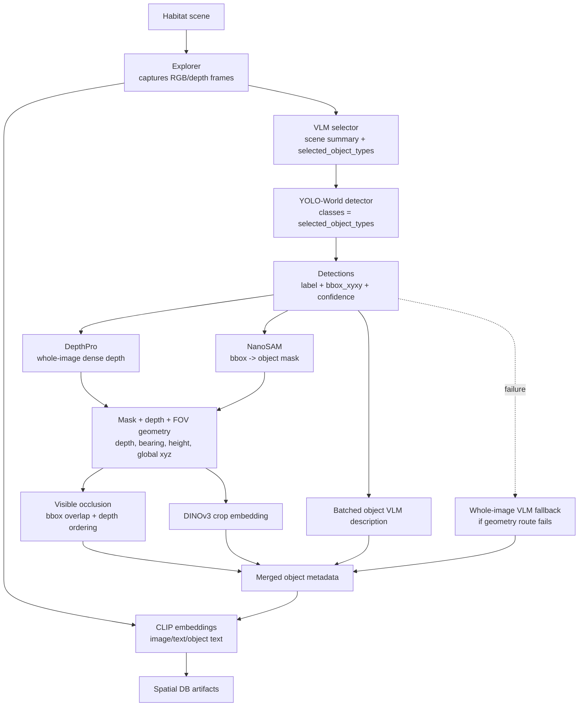
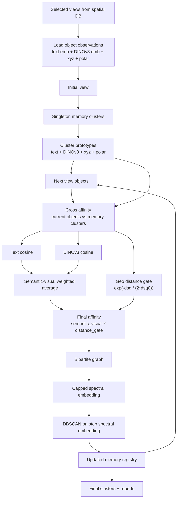

# Spatial RAG Pipeline Documentation

This README documents the current local `spatial_rag/` codebase as a pipeline. The package is currently a flat module layout, so runnable module paths use `python -m spatial_rag.<file_name_without_py>`.

Current core path:

```text
Habitat exploration
  -> VLM selector
  -> YOLO-World detection
  -> NanoSAM mask + DepthPro depth + geometric projection
  -> batched/crop object VLM description
  -> CLIP / DINOv3 embeddings
  -> spatial DB artifacts
  -> VPR / object localization / instance clustering / analysis
```

Important current implementation notes:

- The active DINO branch is **DINOv3**.
- The active sequential pipeline uses `cosine_geo_gate` by default, with `DEFAULT_CROSS_AFFINITY_MIN = 0.5`, `DEFAULT_DISTANCE_GATE_DSQ0 = 4`, and same-view uniqueness enabled.
- Current module paths are flat, for example `python -m spatial_rag.spatial_db_builder`.
- `batch_predict_object_match_mlp.py` is currently a stale wrapper that references missing nested modules.
- `visible_occlusion 2.py` is an exact duplicate of `visible_occlusion.py`.

Coordinate naming note:

- Current DB rows store Habitat pose as `world_position = [x, y, z]`, and duplicate those values into top-level `x`, `y`, `z`.
- Current retrieval and sequential matching code uses `estimated_global_x` and `estimated_global_y` as the planar distance-gate axes.
- Current geometry projection stores the vertical-offset projection in `estimated_global_z`.
- This README describes the code as it exists now, including those field names.

---

## No.1 Prompt Suite For Spatial RAG

The prompt logic is implemented in `spatial_rag/vlm_captioner.py`.

### 1. Caption Image Prompt

**Purpose:**
Generate a concise view-level scene summary for spatial retrieval.

**Code:**

- `VLMCaptioner.caption_image(...)`

**Output:**

- A compact 2-4 sentence scene summary.
- Utility / compatibility API only in the current codebase.
- The main DB builder currently composes frame text from selector/object metadata rather than calling `caption_image(...)` directly.

**Conceptual prompt:**

- System: image understanding assistant for spatial retrieval.
- User: summarize visible scene with key objects and rough layout cues.

---

### 2. Object Crop Prompt

**Purpose:**
Describe one detector-localized object crop. This produces object-level text fields used by the spatial DB:

- `label`
- `short_description`
- `long_description`
- `attributes`
- optional VLM distance / geometry hints
- optional VLM occlusion fields when requested

**Code:**

- `VLMCaptioner.describe_object_crop_with_meta(...)`
- `VLMCaptioner._object_crop_system_prompt(...)`
- `VLMCaptioner._object_crop_user_prompt(...)`
- `VLMCaptioner._object_crop_response_schema(...)`

**Current prompt version:**

```text
object_crop_descriptor_builder_aligned_v8_prelist_label
object_crop_descriptor_builder_aligned_v8_prelist_label_and_occlusion
```

**Core requirements:**

- Return JSON only.
- Describe only the main visible object in the crop.
- Treat detector label as a localization/category hint, not a hard category constraint.
- Choose `label` from the household pre-list in `household_taxonomy.py`; return `unknown` if nothing fits.
- `short_description` should be a concise noun phrase with visible cues.
- `long_description` should include color, material, texture, shape, state, size cues, and cropping/occlusion if visible.
- Do not output generic placeholders when visible cues exist.
- When `include_occlusion=True`, also return `occlusion_level`; the default DB path uses deterministic bbox/depth occlusion instead.

---

### 3. Batched Detected Object Description Prompt

**Purpose:**
Describe all detector-localized objects in one image-level VLM call. This is the current preferred object text path for the mask/depth geometry route because it avoids one VLM call per crop when possible.

**Code:**

- `VLMCaptioner.describe_detected_objects_with_meta(...)`
- `VLMCaptioner._batched_detected_objects_system_prompt(...)`
- `VLMCaptioner._batched_detected_objects_user_prompt(...)`
- `VLMCaptioner._batched_detected_objects_response_schema(...)`

**Current prompt version:**

```text
object_detection_batch_descriptor_textonly_v5_prelist_label
```

**Input:**

- Full RGB image.
- A list of detector results: `det_idx`, `label`, `bbox_xyxy`, `confidence`.

**Output:**

Per detection:

- `det_idx`
- `label`
- `short_description`
- `long_description`
- `attributes`

This text is later merged with geometry metadata from `ObjectGeometryPipeline`.

**Important behavior:**

- This batched prompt is used in the default `visible_mask` occlusion path.
- If `--occlusion_source vlm` is selected, the pipeline falls back to per-crop VLM calls because batched descriptions do not return occlusion labels.
- If object descriptions are precomputed in the staged execution path, the geometry pipeline can reuse those results instead of calling the VLM again.

---

### 4. Object Extraction Prompt

**Purpose:**
Parse a whole image into scene-level attributes and object-level visual features. This path is used for full scene/object JSON parsing and as a fallback when deterministic geometry/detection routes cannot produce usable objects.

**Code:**

- `VLMCaptioner.describe_objects_with_meta(...)`
- `VLMCaptioner._object_system_prompt(...)`
- `VLMCaptioner._object_user_prompt(...)`
- `spatial_rag/object_parser.py`
- `spatial_rag/object_schema.py`

**Current prompt versions:**

```text
home_prompt_surrounding_anchor_height_hierarchy_v3
home_prompt_angle_split_surrounding_anchor_height_hierarchy_v3
```

**Top-level output fields:**

- `view_type`
- `room_function`
- `style_hint`
- `clutter_level`
- `scene_attributes`
- `visual_feature[]`
- `floor_pattern`
- `lighting_ceiling`
- `wall_color`
- `additional_notes`
- `image_summary`

**Per-object output fields:**

- `type`
- `description`
- `attributes`
- `relative_position_laterality`
- `relative_position_distance`
- `relative_position_verticality`
- `distance_from_camera_m`
- `relative_height_from_camera_m`
- `relative_bearing_deg`
- `support_relation`
- `any_text`
- `long_form_open_description`
- `location_relative_to_other_objects`
- `surrounding_context[]`

---

### 5. Selector Prompt

**Purpose:**
Lightweight scene summary and object-category pre-selection. It selects which household object categories are likely visible enough to pass into YOLO-World.

**Code:**

- `VLMCaptioner.select_object_types_with_meta(...)`
- `VLMCaptioner._selector_user_prompt(...)`
- `VLMCaptioner._selector_response_schema(...)`
- `spatial_rag/household_taxonomy.py`

**Current prompt version:**

```text
household_selector_scene_summary_v1
```

**Output:**

- scene attributes
- `floor_pattern`
- `lighting_ceiling`
- `wall_color`
- `additional_notes`
- `image_summary`
- `selected_object_types`

The selected types become the detector class list for `Detector.detect(...)`.

---

### 6. Camera Context Prompt Block

**Purpose:**
Inject camera pose and image geometry into prompts so VLM outputs can estimate relative geometry more consistently.

**Code:**

- `VLMCaptioner._camera_context_prompt_block(...)`

**Fields passed when available:**

- `camera_x`
- `camera_y`
- `camera_orientation_deg`
- `FOV`

**Meaning:**

- Do not ask VLM for absolute global coordinates.
- Ask for relative camera geometry:
  - `distance_from_camera_m`
  - `relative_bearing_deg`
  - `relative_height_from_camera_m`

---

### 7. Cluster Text Compression Prompt

**Purpose:**
Compress multiple observations that already belong to the same memory cluster into one stable object-centric text prototype for sequential clustering.

**Code:**

- `VLMCaptioner.compress_cluster_member_texts(...)`
- `VLMCaptioner._cluster_text_compression_system_prompt(...)`
- `VLMCaptioner._cluster_text_compression_user_prompt(...)`

**Current prompt version:**

```text
sequential_cluster_text_compress_v2_member_spatial
```

**Used by:**

- `spatial_rag/sequential_spectral_experiment.py`
- controlled by `ENABLE_VLM_COMPRESS`
- optional member-internal spatial cues controlled by `ENABLE_VLM_MEMBER_SPATIAL`

---

## No.2 Pipeline 1: VLM -> YOLO-World -> Spatial DB

### Input / Output

**Input:**

- Habitat scene file from `SCENE_PATH` or `--scene_path`
- exploration config from `Explorer`
- VLM model from `SPATIAL_DB_VLM_MODEL`
- detector/model settings from `config.py`

Key defaults from `config.py`:

| Setting | Current value |
| --- | --- |
| `SPATIAL_DB_VLM_MODEL` | `gpt-5-mini` |
| `--meters_per_step` CLI default | `1.5` |
| `SCAN_ANGLES` | `(0, 90, 180, 270)` |
| `OBJECT_MAX_PER_FRAME` | `24` |
| `BBOX_CONF_THRESHOLD` | `0.3` |
| `DETECTOR_TYPE` | `YOLO_WORLD` |
| `YOLO_WORLD_MODEL_PATH` | `yolov8s-world.pt` |
| `OCCLUSION_SOURCE` | `visible_mask` |
| `ENABLE_DINOV3_EMBEDDING` | `True` |
| `STORE_DINOV3_EMBEDDING` | `True` |
| `DINOV3_MODEL_NAME` | `facebook/dinov3-vit7b16-pretrain-lvd1689m` |

**Main command:**

```bash
python -m spatial_rag.spatial_db_builder \
  --builder_variant angle_split \
  --output_dir spatial_db_origin \
  --occlusion_reweight_w1 0.0 \
  --occlusion_reweight_w2 1.0 \
  --occlusion_reweight_b 0 \
  --export_object_crops_by_global_id_dir object_crops_by_global_id
```

**Random smoke run:**

```bash
python -m spatial_rag.spatial_db_builder \
  --builder_variant angle_split \
  --output_dir spatial_db_test \
  --tour_mode random \
  --random_num_steps 3 \
  --occlusion_reweight_w1 0.0 \
  --occlusion_reweight_w2 1.0 \
  --occlusion_reweight_b 0 \
  --export_object_crops_by_global_id_dir object_crops_by_global_id
```

### Execution Modes And Fallbacks

The builder has two execution modes:

- `capture_then_parallel_vlm` is the default. It captures frames, runs selector/object-description work in staged batches where possible, then materializes DB rows.
- `legacy_per_frame` keeps the older per-frame control flow and can also be forced with `--legacy_per_frame true`.

The preferred per-frame object route is:

```text
selector prompt
  -> detector class list
  -> YOLO-World detections
  -> bbox confidence filter
  -> max-object truncation
  -> DepthPro + NanoSAM + angle geometry
  -> batched detected-object VLM description
  -> merged geometry/text object rows
```

If the deterministic geometry route fails for a frame, the builder falls back to the whole-image object extraction prompt (`describe_objects_with_meta`) and marks object rows with `geometry_source = "vlm_fallback"`.

Optional postprocess / filtering:

- `--r_threshold`: drops geometry-derived objects whose `reweighted_detection_score_r` is below the threshold.
- `--run_polar_surrounding_postprocess true`: writes `object_polar_relations.jsonl` and `object_meta_with_polar_surroundings.jsonl`; it does not replace `object_meta.jsonl`.
- `--export_object_crops_by_global_id_dir`: exports final object crops plus a manifest under the DB output directory unless an absolute path is provided.

### Current Floor Exploration Algorithm

The current `full_house` floor exploration is implemented in `Explorer.explore_full_house(...)`. It is an offline Habitat-navmesh coverage planner, not a learned exploration policy, SLAM frontier method, or image-based floor-plan search.

**What the DB builder calls:**

```text
python -m spatial_rag.spatial_db_builder --tour_mode full_house
  -> Explorer.explore_full_house(
       meters_per_step=<CLI --meters_per_step, default 1.5>,
       scan_angles=<CLI --scan_angles, default 0,90,180,270>
     )
```

`Explorer` can auto-select a tour profile internally, but the DB builder currently passes `meters_per_step` from the CLI, so the default full-house grid spacing is `1.5m` unless changed by the user. The walking interpolation step still defaults to the Explorer profile value: `walk_step_m = clip(profile_meters_per_step / 3, 0.3, 0.8)`.

**Algorithm steps:**

1. Initialize Habitat simulator sensors:
   - RGB pinhole camera at `SENSOR_HEIGHT`
   - downward camera for local floor observations
   - orthographic top-down sensor for overview rendering
   - center-highest camera for trajectory overview rendering

2. Initialize the agent at the first navigable point found by scanning scene bounds on a `0.5m` grid.

3. Build a navigable floor grid:
   - read pathfinder bounds: `min_x/max_x`, `min_z/max_z`
   - sample grid coordinates with spacing `meters_per_step`
   - keep only cells where `pathfinder.is_navigable([x, agent_y, z])` is true

4. Split the navigable grid into connected floor regions:
   - use 4-neighbor connectivity on grid keys `(ix, iz)`
   - each connected component is treated as one reachable floor region candidate

5. Choose which region to visit next:
   - from the current position, rank component cells by Euclidean distance
   - test up to 12 nearest candidate cells with Habitat `ShortestPath`
   - pick the reachable component entry with the smallest geodesic distance
   - if remaining components are unreachable, stop the floor tour

6. Add transition waypoints:
   - take the Habitat shortest path to the selected component
   - downsample that path at approximately `meters_per_step`
   - append these connector points so the scan route does not jump visually between regions

7. Traverse inside the selected component:
   - start from the selected entry cell
   - repeatedly use BFS on the 4-neighbor grid to reach the nearest unvisited cell
   - append every cell on that local grid path
   - this makes the order locally continuous, rather than a pure row-by-row sweep

8. Execute the waypoint route:
   - for each target waypoint, call Habitat `ShortestPath` from current position
   - walk along path points with interpolation substeps of `walk_step_m`
   - orient the agent along each movement segment while walking

9. Capture scan views at each waypoint:
   - at the waypoint, set camera yaw to each configured scan angle
   - default scan angles are `0, 90, 180, 270`
   - each captured RGB frame is paired with a pose containing `position` and `rotation`

**Random mode:**

`--tour_mode random` uses `Explorer.explore_custom_tour(...)` instead. It samples a random yaw, proposes a fixed-distance step, keeps the candidate only if it is navigable and reachable by Habitat `ShortestPath`, and captures the same scan-angle set at accepted positions. This is mainly useful for smoke tests and controlled small runs.

**Important interpretation:**

- The floor exploration coverage comes from Habitat pathfinder navigability, not from detecting room boundaries in RGB.
- The top-down floor-plan rendering is used for overview/debug artifacts; it is not the source of the waypoint plan.
- `max_positions` in the builder limits positions after exploration planning; each position contributes `len(scan_angles)` orientation frames.

### High-Level Flow


```mermaid
flowchart TD
    A["Habitat scene"]
    B["Explorer<br/>captures RGB/depth frames"]
    C["VLM selector<br/>scene summary + selected_object_types"]
    D["YOLO-World detector<br/>classes = selected_object_types"]
    E["Detections<br/>label + bbox_xyxy + confidence"]
    F["DepthPro<br/>whole-image dense depth"]
    G["NanoSAM<br/>bbox -> object mask"]
    H["Mask + depth + FOV geometry<br/>depth, bearing, height, global xyz"]
    I["Visible occlusion<br/>bbox overlap + depth ordering"]
    J["DINOv3 crop embedding"]
    K["Batched object VLM description"]
    K2["Whole-image VLM fallback<br/>if geometry route fails"]
    L["Merged object metadata"]
    M["CLIP embeddings<br/>image/text/object text"]
    N["Spatial DB artifacts"]

    A --> B --> C --> D --> E
    E --> F
    E --> G
    F --> H
    G --> H
    H --> I
    H --> J
    E --> K
    E -. failure .-> K2
    I --> L
    J --> L
    K --> L
    K2 --> L
    B --> M
    L --> M
    M --> N
```

### Key Code Locations

| Stage | Main files |
| --- | --- |
| Explore/capture | `explorer.py`, `spatial_db_builder.py` |
| Selector VLM | `vlm_captioner.py`, `household_taxonomy.py` |
| Detection | `detector.py` |
| Mask/depth/geometry | `object_geometry_pipeline.py`, `depth_stats.py` |
| Visible occlusion | `visible_occlusion.py`, `occlusion_scoring.py` |
| Object text parsing | `vlm_captioner.py`, `object_parser.py`, `object_schema.py`, `object_canonicalizer.py` |
| Embeddings | `embedder.py` |
| DB writing | `spatial_db_builder.py` |
| Relation writing | `spatial_db_builder.py`, `object_relation_builder.py`, `graph_builder.py` |

---

### Subpipeline: NanoSAM + DepthPro

#### 1. NanoSAM Mask

**Purpose:**
YOLO-World only returns a rectangular bbox. NanoSAM refines the target region into an object mask so depth and centroid geometry are less affected by background pixels.

**Input:**

- `image_rgb`
- `bbox_xyxy`

**Output:**

- `mask[H, W]`, boolean foreground mask

**Code:**

- `NanoSAMMaskRefiner` in `object_geometry_pipeline.py`
- `ObjectGeometryPipeline.run_for_view(...)`

---

#### 2. DepthPro Depth Estimation

**Step 1: Dense depth map**

- Input: full image.
- Output: `depth_map_m[H, W]`.
- Code: `DepthProAdapter` in `object_geometry_pipeline.py`.

**Step 2: Masked depth aggregation**

- Input: `depth_map_m` + object mask.
- Keep finite positive depth values inside the mask.
- Compute median, trimmed median, p10, p90.
- Current geometry path uses a robust representative depth for object projection.
- Code: `mask_depth_stats(...)` in `object_geometry_pipeline.py` and `depth_stats.py`.

**Step 3: Convert depth into object geometry**

The system combines object depth with mask centroid angles:

- `distance_from_camera_m`
- `projected_planar_distance_m`
- `relative_height_from_camera_m`
- `relative_bearing_deg`
- `estimated_global_x`
- `estimated_global_y`
- `estimated_global_z`

**One-sentence summary:**
DepthPro is run once on the whole image; object depth is aggregated inside the NanoSAM mask; FOV and mask centroid convert that depth into object-level spatial geometry.

---

### Subpipeline: Angle Estimation

The object angle is derived from the mask centroid, not the bbox center.

**Steps:**

1. Compute the object mask centroid:
   `x_obj, y_obj = mean foreground pixel position`.
2. Treat the image center as the optical axis:
   `cx = (W - 1) / 2`, `cy = (H - 1) / 2`.
3. Infer camera focal lengths from horizontal FOV and image aspect ratio.
4. Convert pixel offset into angles:
   - `relative_bearing_deg = atan((x_obj - cx) / fx)`
   - `vertical_angle_deg = atan((cy - y_obj) / fy)`
5. Project object position into global coordinates using camera pose and orientation.

**Code:**

- `mask_centroid(...)`
- `pixel_center_to_relative_angles_deg(...)`
- `project_global_xyz_from_geometry(...)`
- `ObjectGeometryPipeline.run_for_view(...)`

---

### Subpipeline: Visible Occlusion Estimation

The current deterministic `occlusion_source` default is `visible_mask`, but the actual implementation is bbox overlap + depth ordering.

**What it measures:**

For each kept detection, among other kept detections in the same image:

- how much of the target bbox is covered by other bboxes
- whether those overlapping boxes are closer to the camera
- union overlap area as a ratio of target bbox area

Only detections that survive class matching, `bbox_conf_threshold`, and `object_max_per_frame` truncation participate in deterministic occlusion. Low-confidence class-matched detections are written to `filtered_detections.json` / `filtered_detection_overlay.jpg` when artifacts are enabled, but they do not become objects and do not occlude other objects.

**Important defaults:**

- `bbox_conf_threshold = 0.3`
- `occlusion_target_overlap_threshold = 0.1`
- `visible_occ_depth_margin_delta = 0.0`

**Pseudo code:**

```text
kept = detections with confidence >= bbox_conf_threshold

for target in kept:
    target_depth = target.object_depth_median
    foreground_regions = []

    for other in kept:
        if other == target:
            continue

        target_overlap_ratio = intersection_area(target.bbox, other.bbox) / area(target.bbox)
        if target_overlap_ratio < occlusion_target_overlap_threshold:
            continue

        if other.depth < target_depth - depth_margin_delta:
            foreground_regions.append(intersection(target.bbox, other.bbox))

    visible_occlusion_ratio = union_area(foreground_regions) / area(target.bbox)
    occlusion_level = bucket(visible_occlusion_ratio)
    occlusion_penalty_p_o = 0.5 * visible_occlusion_ratio
```

**Level buckets:**

- `< 0.10`: `fully visible`
- `0.10 - 0.30`: `slightly occluded`
- `0.30 - 0.60`: `moderately occluded`
- `>= 0.60`: `heavily occluded`

**Score formula:**

For the deterministic `visible_mask` path:

```text
p_o = 0.5 * visible_occlusion_ratio
r = sigmoid(w1 * logit(detector_confidence) - w2 * p_o + b)
```

For `--occlusion_source vlm`, `p_o` comes from the fixed occlusion-level mapping in `occlusion_scoring.py`:

| Level | Penalty |
| --- | ---: |
| `fully visible` | 0.0 |
| `slightly occluded` | 0.1 |
| `moderately occluded` | 0.25 |
| `heavily occluded` | 0.5 |
| `uncertain` | 0.35 |

**Code:**

- `visible_occlusion.py`
- `occlusion_scoring.py`
- `object_geometry_pipeline.py`
- `spatial_db_builder.py`

---

### Subpipeline: DINOv3 Crop Embedding

Each accepted object crop can be encoded with DINOv3.

**Config:**

- `DINOV3_MODEL_NAME`
- `DINOV3_BATCH_SIZE`
- `DINOV3_NORMALIZE`
- `ENABLE_DINOV3_EMBEDDING`
- `STORE_DINOV3_EMBEDDING`

**Output files:**

- `object_dinov3_emb.npy`
- `dinov3_embedding_row_index` in `object_meta.jsonl`

**Code:**

- `DINOv3Embedder` in `embedder.py`
- DINO integration in `object_geometry_pipeline.py`
- DB storage in `spatial_db_builder.py`
- loading via `load_object_dinov3_db(...)` in `object_index.py`

---

## No.3 Spatial DB Artifacts

The builder writes these core artifacts:

| Artifact | Meaning |
| --- | --- |
| `meta.jsonl` / `metadata.jsonl` | view/frame-level metadata |
| `raw_api_responses.jsonl` | per-frame raw VLM/API envelope, selected types, geometry artifact paths, and timing fields |
| `per_image_timings.jsonl` | compact per-frame timing and route summary |
| `image_emb.npy` | CLIP image embeddings |
| `text_emb_short.npy` | frame short-text embeddings |
| `text_emb_long.npy` | frame long-text embeddings |
| `image_index.faiss` | FAISS index over image embeddings |
| `text_index_short.faiss` / `text_index_long.faiss` | FAISS indexes over frame text embeddings |
| `object_meta.jsonl` | object-level metadata |
| `object_text_emb_short.npy` | object short-text embeddings |
| `object_text_emb_long.npy` | object long-text embeddings |
| `object_dinov3_emb.npy` | DINOv3 object crop embeddings |
| `object_index_short.faiss` / `object_index_long.faiss` | FAISS indexes over object text embeddings |
| `view_object_relations.jsonl` | view-object graph edges |
| `object_object_relations.jsonl` | object-object spatial graph edges |
| `object_r_scores_pre_threshold.csv` | object scores before threshold filtering |
| `object_r_scores.csv` | final object scores |
| `build_report.json` | build config, counts, timings, summary |
| `geometry/` | per-view geometry artifacts, masks, crops, overlays, depth maps |
| `overview/` | floor-plan / trajectory overview images and projection metadata |
| `vlm_cache/`, `vlm_object_cache/` | cached VLM responses |

Optional artifacts:

| Artifact | Trigger |
| --- | --- |
| `object_polar_relations.jsonl` | `--run_polar_surrounding_postprocess true` or `python -m spatial_rag.polar_surrounding_postprocess` |
| `object_meta_with_polar_surroundings.jsonl` | same polar postprocess; contains populated `surrounding_context` and `surrounding_source` |
| `object_crops_by_global_id/` | `--export_object_crops_by_global_id_dir ...` |

---

## No.4 Query Pipelines

### 1. VPR Query

**Purpose:**
Given a query camera pose, capture/render a query image, describe/embed it, and retrieve likely matching DB views.

**Command:**

```bash
python -m spatial_rag.vpr_query \
  --db_dir spatial_db_origin \
  --x0 0.0 \
  --y0 0.0 \
  --theta0 0.0 \
  --top_k 5 \
  --results_dir vpr_results/query
```

**Code:**

- `vpr_query.py`
- `VLMCaptioner`
- `object_canonicalizer.py`

**Query artifacts:**

- `query_image.jpg`
- `query_overlay.jpg`
- timestamped `query_*.json`

**Similarity:**

`vpr_query.py` loads `meta.jsonl`, `image_emb.npy`, and either `text_emb_short.npy` or `text_emb_long.npy`, then computes:

```text
fused = w_img * image_cosine + w_txt * text_cosine
```

---

### 2. Object Localization Query

**Purpose:**
Given a query pose, detect a query object, describe it, embed it, retrieve matching object records, and aggregate object-level matches back to candidate DB views.

**Command:**

```bash
python -m spatial_rag.object_localization_query \
  --db_dir spatial_db_origin \
  --x0 0.0 \
  --y0 0.0 \
  --theta0 0.0 \
  --top_k 5 \
  --results_dir object_vpr_results/query
```

**Code:**

- `object_localization_query.py`
- `detector.py`
- `vlm_captioner.py`
- `object_index.py`
- `vpr_query.py`

**Query artifacts:**

- `query_image.jpg`
- `query_detection_overlay.jpg`
- `query_object_crop.jpg`
- `retrieval_topk_overlay.jpg`
- `top_k_contact_sheet.jpg`
- timestamped `query_*.json`

**Similarity:**

The query crop is described by the object-crop prompt, embedded with CLIP text, searched against `object_index_short.faiss` or `object_index_long.faiss`, and then object matches are aggregated back to DB views.

---

## No.5 Object Instance Pipeline

### 1. Batch Multi-View Dedup Pipeline

**Summary:**

```text
object metadata
  -> object text selection
  -> CLIP text embeddings
  -> affinity matrix
  -> same-view penalty / threshold
  -> spectral clustering
  -> object instance groups
```

**Command:**

```bash
python -m spatial_rag.object_instance_clustering \
  --db_dir spatial_db_origin \
  --output_dir object_instance_run \
  --text_mode long \
  --cluster_count_mode eigengap \
  --same_view_policy soft_penalty
```

**Text modes:**

- `short`: concise object text
- `long`: long object description
- `long_neighbors`: long object description plus serialized surrounding context
- `dinov3`: use precomputed DINOv3 object crop embeddings where available

**Code:**

- `object_instance_clustering.py`
- `object_canonicalizer.py`
- `object_index.py`
- `graph_builder.py`

**Important behavior:**

- This batch pipeline is mostly text/representation driven.
- It can use neighbor context through `long_neighbors` only if the loaded `object_meta.jsonl` rows contain populated `surrounding_context`.
- The builder's polar postprocess default writes `object_meta_with_polar_surroundings.jsonl` separately; `object_instance_clustering.py` still loads `object_meta.jsonl`, so use the postprocessed file intentionally if you want neighbor-enhanced clustering.
- Same-view handling is controlled by `same_view_policy`.
- It is different from the sequential pipeline below.

**Outputs:**

- top-level `summary.json`
- optional `instance_candidate_graph.json`
- per-group folders such as `selected_views/` or place ids
- per-group `objects.json`
- `cluster_labels.json`
- `cluster_summary.json` / `cluster_summary.md`
- `clustered_similarity_matrix.csv`
- `view_annotations/` overlays and `manifest.json`
- optional refined-graph artifacts when that path is used

---

### 2. Sequential Pipeline

**Current default:**

```text
text embedding + optional DINOv3 embedding + global geo distance gate
  -> optional same-view hard masking
  -> bipartite spectral graph
  -> DBSCAN materialization
  -> optional same-view uniqueness split
  -> updated memory clusters
```

**Command:**

```bash
python -m spatial_rag.sequential_spectral_experiment \
  --db_dir spatial_db_test \
  --output_dir sequential_dbscan_run \
  --similarity_mode cosine_geo_gate \
  --distance_gate_dsq0 2.0 \
  --min_cross_affinity 0.25 \
  --dbscan_min_samples 2
```

With DINOv3 scoring:

```bash
python -m spatial_rag.sequential_spectral_experiment \
  --db_dir spatial_db_test \
  --similarity_mode cosine_geo_gate \
  --enable_dinov3_scoring \
  --weight_text 1.0 \
  --weight_dinov3 1.0 \
  --distance_gate_dsq0 4.0
```

### Sequential Flow


```mermaid
flowchart TD
    A["Selected views from spatial DB"]
    B["Load object observations<br/>text emb + DINOv3 emb + xyz + polar"]
    C["Initial view"]
    D["Singleton memory clusters"]
    E["Cluster prototypes<br/>text + DINOv3 + xyz + polar"]
    F["Next view objects"]
    G["Cross affinity<br/>current objects vs memory clusters"]
    H["Text cosine"]
    I["DINOv3 cosine"]
    J["Semantic-visual weighted average"]
    K["Geo distance gate<br/>exp(-dsq / (2*dsq0))"]
    L["Final affinity<br/>semantic_visual * distance_gate"]
    M["Bipartite graph"]
    N["Capped spectral embedding"]
    O["DBSCAN on step spectral embedding"]
    P["Updated memory registry"]
    Q["Final clusters + reports"]

    A --> B --> C --> D --> E --> F
    F --> G
    E --> G
    G --> H --> J
    G --> I --> J
    G --> K
    J --> L
    K --> L
    L --> M --> N --> O --> P
    P --> F
    P --> Q
```

### Current Similarity Formula

Default mode is:

```text
similarity_mode = cosine_geo_gate
```

The score is:

```text
semantic_visual_similarity = weighted_average(text_similarity, dinov3_similarity)
distance_gate = exp(-dsq / (2 * distance_gate_dsq0))
combined_similarity = semantic_visual_similarity * distance_gate
```

Where:

- `text_similarity` is cosine between row text embedding and cluster `prototype_embedding`.
- `dinov3_similarity` is cosine between row DINOv3 crop embedding and cluster `prototype_dinov3_embedding`.
- `dsq` is squared planar distance between row global position and cluster prototype position.
- If DINOv3 is missing or disabled, the score renormalizes over available text terms.
- If geometry is missing, distance gate falls back to `1.0`.

The compatibility path `legacy_weighted_fusion` still exists.

Current defaults from code:

| Parameter | Default |
| --- | ---: |
| `similarity_mode` | `cosine_geo_gate` |
| `distance_gate_dsq0` | `4` |
| `min_cross_affinity` | `0.5` |
| `dbscan_min_samples` | `2` |
| `enforce_same_view_uniqueness` | `true` |
| `enable_dinov3_scoring` | `true` |
| `enable_vlm_compress` | `true` |
| `enable_vlm_member_spatial` | `true` |

### Cluster Prototypes

Each memory cluster stores representative values:

| Prototype | Source | Role |
| --- | --- | --- |
| `prototype_embedding` | mean of member text embeddings, normalized | semantic text center |
| `prototype_dinov3_embedding` | mean of member DINOv3 embeddings, normalized | crop visual center |
| `prototype_xyz` | median of `estimated_global_x/y/z` | world position center |
| `prototype_polar` | median of camera-relative polar fields | diagnostic / legacy comparison |

### DBSCAN Materialization

After spectral embedding is computed for the step graph, DBSCAN assigns the next memory registry:

- DBSCAN group with old memory nodes: merge represented rows and reuse the smallest existing `cluster_id`.
- DBSCAN group with only current objects: allocate a new `cluster_id`.
- DBSCAN noise memory node: keep singleton memory cluster.
- DBSCAN noise current object: create a new singleton cluster.

When `enforce_same_view_uniqueness` is true, the code also:

- masks cross edges between current objects and memory clusters that already contain the same `view_id`;
- splits DBSCAN groups that would otherwise contain multiple observations from the same view.

The older append/merge/reattach/tail terminology remains in report fields for compatibility, but the active materialization decision is DBSCAN grouping plus same-view uniqueness handling.

### Outputs

Typical sequential outputs include:

- `experiment_report.json`
- `sequence_manifest.json`
- `global_object_list_final.json`
- `object_cluster_similarity_table.csv`
- `step_XX_object_assignment_table.csv`
- `step_XX_cluster_update.json`
- `step_XX_cross_affinity_matrix.npy`
- `step_XX_affinity_matrix.npy`
- `step_XX_cocluster_matrix.npy` / `.csv`
- co-cluster / Laplacian visualizations
- `cumulative_cluster_progression_manifest.json`
- per-step cluster artifacts
- optional distance-gate sweep directories when `--distance_gate_dsq0_values` is passed

---

## No.6 Reweighting And Threshold Ablation

### Reweight Sweep

Use this to regenerate object scores and DB variants without rebuilding the original DB.

```bash
python -m spatial_rag.reweight_sweep \
  --db_dir spatial_db_origin \
  --w1_values 1 \
  --w2_values 1 \
  --b_values 0 \
  --thresholds none \
  --export_db_variants true \
  --output_dir spatial_db_var_w1_1_w2_1_b_0
```

**Code:**

- `reweight_sweep.py`
- `occlusion_scoring.py`
- `spatial_db_builder.py`

**Outputs:**

- timestamped sweep root under `--output_dir`
- `sweep_summary.json`
- `sweep_results.csv`
- per-config folders named `config_<token>/`
- optional exported DB variants with refreshed `object_meta.jsonl`, score CSVs, FAISS indexes, and `build_report.json`
- optional filtered-object crop exports

### Threshold Ablation

```bash
python -m spatial_rag.spectral_threshold_ablation \
  --db_dir spatial_db_origin \
  --entry_ids 15,19,23,27,31,35,39 \
  --thresholds 0.4 \
  --export_filtered_objects true \
  --weight_text 0 \
  --weight_dinov3 1 \
  --distance_gate_dsq0 4.0 \
  --output_dir evaluation/threshold_ablation_more
```

**Code:**

- `spectral_threshold_ablation.py`
- `reweight_sweep.py`
- `object_instance_clustering.py`
- `sequential_spectral_experiment.py`

**Outputs:**

- `summary.json`
- `threshold_results.csv`
- `threshold_results.md`
- one `threshold_<token>/` directory per threshold
- each threshold directory links/copies a `db_variant`, runs batch `object_instance`, and runs sequential clustering

---

## No.7 Semantic GT And Pair Mining

### Build Semantic GT Dataset

```bash
python -m spatial_rag.semantic_label_dataset \
  --spatial_db_dir spatial_db_origin \
  --scene_path data/scene_datasets/scene_datasets/hm3d/minival/00800-TEEsavR23oF/TEEsavR23oF.basis.glb \
  --semantic_txt_path data/scene_datasets/scene_datasets/hm3d/minival/00800-TEEsavR23oF/TEEsavR23oF.semantic.txt \
  --output_dir semantic_gt_dataset
```

Outputs include:

- `semantic_gt_object_meta.jsonl`
- `semantic_gt_skipped.jsonl`
- `object_text_emb_short.npy`
- `object_text_emb_long.npy`
- optional `view_image_emb.npy`
- optional `object_dinov3_emb.npy`
- `gt_label_ids.npy`
- `gt_label_vocab.json`
- `semantic_gt_stats.json`

### Mine Semantic Pair Candidates

```bash
python -m spatial_rag.semantic_instance_pair_mining \
  --db_dir spatial_db_origin \
  --semantic_meta_path semantic_gt_dataset/semantic_gt_object_meta.jsonl \
  --output_dir semantic_pair_candidates \
  --view_ids 15,19,23,27
```

It produces `candidates.jsonl`, per-pair folders with `pair_manifest.json`, copied crop/frame images when available, and a README for manual labeling.

### Mine Heuristic Object Pair Candidates

```bash
python -m spatial_rag.object_instance_pair_mining \
  --db_dir spatial_db_origin \
  --output_dir object_pair_candidates \
  --max_pairs_per_bucket 50
```

It mines heuristic buckets such as same-label/same-place, same-label/adjacent-place, same-label/distant-place, and different-label/same-place. Suggested labels are heuristics and are intended for human verification.

---

## Appendix A: Metadata Format

### 1. `meta.jsonl` / `metadata.jsonl`

Each record represents one captured view.

The current builder mirrors the Habitat pose into both `world_position` and top-level `x/y/z`. Do not assume the old documentation convention where top-level `y` meant Habitat `z`; use the fields exactly as written by the current code.

```json
{
  "id": 0,
  "frame_id": 0,
  "x": -11.947,
  "y": -0.237,
  "z": -2.973,
  "world_position": [-11.947, -0.237, -2.973],
  "orientation": 0,
  "file_name": "images/pose_00000_o000_000000.jpg",
  "text": "black-framed sailboat print, glazed | ...",
  "frame_text_short": "black-framed sailboat print, glazed | ...",
  "frame_text_long": "center sector | rectangular black frame ...",
  "parse_status": "ok",
  "parse_warnings": [],
  "raw_vlm_output": "{\"view_type\":\"staircase\",...}",
  "raw_api_source": "api",
  "text_input_for_clip_short": "black-framed sailboat print, glazed | ...",
  "text_input_for_clip_long": "center sector | rectangular black frame ...",
  "object_text_inputs_short": ["black-framed sailboat print, glazed"],
  "object_text_inputs_long": ["center sector | rectangular black frame ..."],
  "builder_variant": "angle_split",
  "object_prompt_variant": "angle_split",
  "attribute": {
    "view_type": "staircase",
    "room_function": "circulation",
    "style_hint": "traditional",
    "clutter_level": "low",
    "scene_attributes": ["beige walls", "carpeted stairs"],
    "image_summary": "Interior view of a staircase area."
  },
  "object_count": 3
}
```

### 2. `object_meta.jsonl`

Each record represents one object observation.

```json
{
  "object_global_id": 0,
  "frame_id": 0,
  "entry_id": 0,
  "view_id": "view_00000",
  "file_name": "images/pose_00000_o000_000000.jpg",

  "x": -11.947,
  "y": -0.237,
  "z": -2.973,
  "world_position": [-11.947, -0.237, -2.973],
  "orientation": 0,
  "frame_orientation": 0,
  "object_orientation_deg": 344,
  "angle_bucket": "center",
  "builder_variant": "angle_split",

  "object_local_id": "det_000",
  "label": "picture frame",
  "final_label": "picture frame",
  "label_source": "vlm",
  "label_conflict": false,
  "object_confidence": 0.9086,
  "detector_label": "picture frame",
  "detector_label_raw": "picture frame",
  "detector_confidence": 0.9086,
  "vlm_label": "picture frame",

  "bbox_xyxy": [1109.39, 65.16, 1379.45, 309.91],
  "bbox_xywh_norm": [0.5778, 0.0603, 0.1407, 0.2266],
  "description": "black-framed sailboat print",
  "long_form_open_description": "Rectangular black frame with a sailboat print...",
  "attributes": ["black frame", "white mat"],

  "laterality": "center",
  "distance_bin": "middle",
  "verticality": "high",
  "distance_from_camera_m": 3.7554,
  "relative_height_from_camera_m": 1.3745,
  "relative_bearing_deg": 16.4281,
  "vertical_angle_deg": 20.1034,
  "projected_planar_distance_m": 3.9152,
  "estimated_global_x": -10.8397,
  "estimated_global_y": -3.992,
  "estimated_global_z": -1.5983,

  "geometry_source": "mask_depth",
  "geometry_fallback_reason": null,
  "mask_area_px": 59000,
  "mask_area_ratio": 0.02845,
  "mask_centroid_x_px": 1242.55,
  "mask_centroid_y_px": 188.13,
  "depth_stat_median_m": 3.7554,
  "depth_stat_p10_m": 3.7353,
  "depth_stat_p90_m": 3.7744,
  "object_depth_median": 3.7554,

  "occlusion_source": "visible_mask",
  "occlusion_level": "fully visible",
  "visible_occlusion_ratio": 0.0,
  "occlusion_penalty_p_o": 0.0,
  "reweighted_detection_score_r": 0.5,
  "occluding_overlap_pixel_count": 0,
  "foreground_occluder_count": 0,
  "occlusion_target_overlap_threshold": 0.1,

  "object_text_short": "black-framed sailboat print",
  "object_text_long": "center sector | rectangular black frame...",
  "text_input_for_clip_short": "black-framed sailboat print",
  "text_input_for_clip_long": "center sector | rectangular black frame...",

  "crop_path": "spatial_db_origin/geometry/view_00000/objects/obj_000_crop.jpg",
  "mask_path": "spatial_db_origin/geometry/view_00000/objects/obj_000_mask.png",
  "mask_overlay_path": "spatial_db_origin/geometry/view_00000/objects/obj_000_mask_overlay.jpg",
  "depth_map_path": "spatial_db_origin/geometry/view_00000/depth_map.npy",

  "dinov3_embedding_row_index": 0,
  "dinov3_model_name": "facebook/dinov3-vit7b16-pretrain-lvd1689m",
  "dinov3_embedding_dim": 4096,
  "dinov3_input_type": "bbox_crop",
  "dinov3_normalized": true,
  "dinov3_status": "success",
  "dinov3_failure_reason": null,

  "surrounding_context": [],
  "view_type": "staircase",
  "room_function": "circulation",
  "style_hint": "traditional",
  "clutter_level": "low"
}
```

The full DINOv3 vectors are stored in `object_dinov3_emb.npy`. `object_meta.jsonl` stores only row indices and metadata.

`reweighted_detection_score_r` depends on `--occlusion_reweight_w1`, `--occlusion_reweight_w2`, and `--occlusion_reweight_b`. In the common command above, `w1=0` and `b=0`, so a fully visible object receives `r = sigmoid(0) = 0.5`.

`surrounding_source` is not written to default `object_meta.jsonl`. It appears in `object_meta_with_polar_surroundings.jsonl` when the polar surrounding postprocess is run.

### 3. `surrounding_context`

```json
{
  "target_object_global_id": 1,
  "label": "chair",
  "distance_from_primary_m": 0.75,
  "delta_angle_deg": 18.4,
  "delta_depth_m": -0.1,
  "delta_height_m": 0.2,
  "semantic_relation_local": "slightly right, above",
  "relation_to_primary": "slightly right, above",
  "allocentric_bearing_deg": 90.5,
  "allocentric_direction_8": "E",
  "estimated_global_x": -9.34,
  "estimated_global_y": -4.20,
  "estimated_global_z": -1.40,
  "surrounding_source": "polar_postprocess_v1"
}
```

### 4. `view_object_relations.jsonl`

```json
{
  "entry_id": 0,
  "view_id": "view_00000",
  "object_global_id": 0,
  "obs_id": "obs_000000",
  "label": "picture frame",
  "view_x": -11.947,
  "view_y": -0.237,
  "view_z": -2.973,
  "object_x": -10.8397,
  "object_y": -3.992,
  "object_z": -1.5983,
  "dx": 1.1073,
  "dy": -3.7554,
  "dz": 1.3747,
  "distance_m": 3.9152,
  "distance_3d_m": 4.1495,
  "direction": "in",
  "direction_frame": "view_aligned",
  "vertical_direction": "above",
  "relation_type": "ViewObject"
}
```

### 5. `object_object_relations.jsonl`

```json
{
  "entry_id": 0,
  "view_id": "view_00000",
  "source_object_global_id": 0,
  "target_object_global_id": 1,
  "source_label": "picture frame",
  "target_label": "chair",
  "source_x": -10.8397,
  "source_y": -3.992,
  "source_z": -1.5983,
  "target_x": -9.3437,
  "target_y": -4.6544,
  "target_z": -1.5846,
  "dx": 1.496,
  "dy": -0.6624,
  "dz": 0.0137,
  "distance_m": 1.6361,
  "distance_3d_m": 1.6362,
  "direction": "right",
  "direction_frame": "view_aligned",
  "vertical_direction": "above",
  "relation_type": "ObjectObject",
  "relation_source": "geometry_postprocess"
}
```

---

## Appendix B: File Guide

### Core Runtime

| File | Role | Importance |
| --- | --- | --- |
| `config.py` | Global paths, model names, DINOv3, VLM, occlusion, and sequential defaults. | Core |
| `spatial_db_builder.py` | Main spatial DB builder and artifact writer. | Core |
| `object_geometry_pipeline.py` | YOLO detections to masks/depth/geometry/occlusion/DINOv3. | Core |
| `vlm_captioner.py` | All VLM prompt families, JSON schemas, caching, and cluster compression. | Core |
| `detector.py` | YOLO / YOLO-World / GroundingDINO wrapper. | Core |
| `embedder.py` | CLIP and DINOv3 embedding wrappers. | Core |
| `explorer.py` | Habitat simulator capture/navigation utilities. | Core |
| `explorer_semantic.py` | Habitat explorer variant with semantic sensor support for semantic GT generation. | Core for semantic GT |
| `object_schema.py` | Pydantic schema for structured scene/object data. | Core |
| `object_parser.py` | Normalizes VLM JSON into schema objects. | Core |
| `object_canonicalizer.py` | Stable text generation for frame/object embeddings. | Core |
| `object_index.py` | Loads object DB and embedding sidecars. | Core |
| `vpr_query.py` | View/place retrieval. | Core |
| `object_localization_query.py` | Object-centric localization retrieval. | Core |
| `household_taxonomy.py` | Household category list and label normalization. | Core |
| `occlusion_scoring.py` | Occlusion penalty and reweighted score formula. | Core |
| `visible_occlusion.py` | Bbox/depth visible occlusion measurement. | Core |

### Analysis / Evaluation / Utilities

| File | Role |
| --- | --- |
| `object_instance_clustering.py` | Batch same-instance clustering. |
| `sequential_spectral_experiment.py` | Sequential spectral + DBSCAN clustering. |
| `object_instance_eval.py` | Same-instance representation evaluation. |
| `object_instance_pair_mining.py` | Heuristic candidate pair mining. |
| `semantic_label_dataset.py` | Habitat semantic GT dataset builder. |
| `semantic_instance_pair_mining.py` | Semantic GT candidate pair mining. |
| `export_pipeline_same_object_groups.py` | Exports same-instance groups from positive candidate pairs. |
| `export_object_crops_by_global_id.py` | Exports one crop per final object id. |
| `export_object_occlusion_levels.py` | Exports object id / occlusion level CSV. |
| `reweight_sweep.py` | Offline score reweighting and DB variant export. |
| `spectral_threshold_ablation.py` | Threshold ablation pipeline. |
| `vpr_batch_test.py` | Batch VPR evaluation. |
| `object_localization_batch_test.py` | Batch object-localization evaluation. |
| `graph_builder.py` | Graph payload and Neo4j load/query helpers. |
| `graph_query_test_pipeline.py` | Neo4j graph query smoke tests. |
| `object_relation_builder.py` | Rebuild relation files from existing DB metadata. |
| `polar_surrounding_postprocess.py` | Recompute surrounding object relations. |
| `floor_plan_projection_backfill.py` | Backfill floor-plan projection metadata. |
| `object_birdview_visualizer.py` | Bird-view object visualization. |
| `score_threshold_analysis.py` | Score distribution / threshold analysis. |
| `room_object_similarity_analysis.py` | Room/object similarity matrix analysis. |
| `hm3d_depth_eval.py` | Depth evaluation against Habitat/HM3D. |
| `object_coordinate_gap_eval.py` | Object coordinate gap evaluation. |
| `diagnose_geometry_fallback.py` | Geometry fallback diagnostics. |
| `object_crop_prompt_probe.py` | Object crop prompt probing. |
| `__init__.py` | Package marker. |

### Legacy / Needs Attention

| File | Status |
| --- | --- |
| `main.py`, `memory.py`, `retriever.py`, `llm_utils.py`, `inspect_memory.py`, `reset_memory.py` | Early memory-based demo path; not the current main DB pipeline. |
| `batch_predict_object_match_mlp.py` | Stale wrapper that references missing nested modules; not runnable as-is in the flat layout. |
| `visible_occlusion 2.py` | Duplicate of `visible_occlusion.py`; safe to remove after confirming no external script imports it. |
| `root_cause_spatial_db_origin.py` | Hard-coded historical analysis script with stale DINOv2 field names; keep only if those old analysis runs are still needed. |

---

## Appendix C: Common Troubleshooting

- If DINO vectors are missing, check `object_dinov3_emb.npy`, `ENABLE_DINOV3_EMBEDDING`, and `STORE_DINOV3_EMBEDDING`.
- If VLM calls are too expensive, use cache directories and lower random smoke-run step counts.
- If object crops are missing, pass `--export_object_crops_by_global_id_dir` or run `python -m spatial_rag.export_object_crops_by_global_id`.
- If Habitat scene loading fails, verify `SCENE_PATH`, scene dataset config, and local HM3D/Habitat paths.
- If an import mentions `spatial_rag.instance_matching`, `spatial_rag.database`, `spatial_rag.perception`, or `_compat`, it belongs to the older nested layout and must be updated or intentionally restored.
